# ⚽ Soccer Engine Dart - Complete Documentation

Welcome to the comprehensive documentation hub for the **Soccer Engine Dart** ecosystem - a sophisticated, multi-component soccer simulation and management platform built with Dart/Flutter using Test-Driven Development methodology.

## 🎯 Project Overview

The Soccer Engine Dart is a complete soccer ecosystem consisting of multiple integrated components that work together to provide realistic soccer simulation, data generation, and management experiences optimized for mobile gaming on Samsung Galaxy S25 Ultra.

### 🏗️ System Architecture

```mermaid
graph TD
    A[⚽ Soccer Engine Dart Ecosystem] --> B[🚀 Engine Core]
    A --> C[📊 League Generator]
    A --> D[📱 Flutter UI]
    A --> E[🛠️ Shared Utilities]
    
    B --> B1[🧠 AI Systems]
    B --> B2[⚽ Match Simulation]
    B --> B3[👥 Team Management]
    B --> B4[💰 Financial Systems]
    
    C --> C1[🏭 Data Generators]
    C --> C2[🌍 Cultural Authenticity]
    C --> C3[📊 Variable Squad Sizes]
    C --> C4[📱 Mobile Optimization]
    
    D --> D1[🎮 Game Interface]
    D --> D2[📊 Analytics Dashboard]
    D --> D3[⚙️ Configuration UI]
    
    E --> E1[🔄 Data Adapters]
    E --> E2[📊 Shared Models]
    E --> E3[🔧 Common Utilities]
    
    style A fill:#e8f5e8
    style B fill:#fff2cc
    style C fill:#f3e5f5
    style D fill:#e5f3ff
    style E fill:#f0f0f0
```



## 📚 Documentation Sections

### 🚀 [Engine Core Documentation](engine/)
**Status: ✅ Complete** | **Target: Developers & Contributors**

The heart of the soccer simulation system featuring advanced AI-driven team management, statistical match simulation, and comprehensive modeling.

**What you'll find:**
- 🎓 **Developer Onboarding** - Setup, TDD workflow, and contribution guidelines
- 📖 **API Reference** - Complete documentation for all models, AI systems, and game mechanics
- 🏗️ **Technical Documentation** - System architecture, AI design, and performance considerations

**Key Features:**
- 🧠 Smart AI system with multiple GM personalities
- ⚽ Statistical match simulation with tactical depth
- 👥 Complete team and player management
- 💰 Financial systems with FFP compliance
- 🌱 Youth academy and player development

**Quick Start:**
```bash
cd engine/
dart pub get
dart run build_runner build
dart test
dart run bin/demo.dart help
```

---

### 📊 [League Generator Documentation](league-generator/)
**Status: ✅ Complete** | **Target: Data Scientists & Game Developers**

Powerful data generation library for creating realistic soccer leagues with authentic cultural data and variable squad sizes.

**What you'll find:**
- 🏭 **Generators Reference** - Complete API for all generator classes
- 📋 **Models Documentation** - Data models and variable squad systems
- ⚙️ **Configuration Guide** - Mobile optimization and cultural settings
- 🛠️ **Utilities Reference** - Helper functions and data adapters

**Key Features:**
- 📊 Variable squad sizes (18-32 players) based on team reputation
- 🌍 Cultural authenticity with 20+ countries
- 🔄 Cross-project data adapters (Generator ↔ Engine ↔ UI)

**Quick Start:**
```dart
import 'package:soccer_data_generator/soccer_data_generator.dart';

final generator = LeagueGenerator(seed: 42);
final league = await generator.generateCompleteLeague(
  country: CountryRepository.getCountryByCode('BR')!,
  config: GenerationConfig.galaxyS25Ultra(country),
);
```

---

### 📱 [Flutter UI Documentation](ui/)
**Status: 🚧 In Development** | **Target: Mobile Developers & Designers**

*Modern Flutter interface optimized for Samsung Galaxy S25 Ultra gaming experience.*

**Planned Documentation:**
- 🎮 **UI Components** - Reusable widgets and game interfaces
- 🎨 **Design System** - Themes, colors, and mobile-first design patterns
- 📊 **State Management** - App architecture and data flow
- 📱 **Mobile Optimization** - Galaxy S25 Ultra specific features

---

### 🛠️ [Shared Utilities Documentation](utilities/)
**Status: 🚧 In Development** | **Target: All Developers**

*Common utilities, models, and helpers shared across all components.*

**Planned Documentation:**
- 🔄 **Data Adapters** - Component integration utilities
- 📊 **Shared Models** - Common data structures
- 🔧 **Helper Functions** - Validation, formatting, and utility functions
- 📱 **Mobile Utilities** - Performance and battery optimization

**Coming Soon:**
- Cross-component data validation
- Performance monitoring tools
- Shared testing utilities
- Common configuration management

---

## 🚀 Quick Start Guide

### For Game Developers
```bash
# 1. Start with the Engine for core functionality
cd engine/
dart pub get && dart run build_runner build
dart run bin/demo.dart

# 2. Generate realistic data
cd ../generator/
dart run example/generate_league.dart

# 3. Explore UI components (when available)
cd ../ui/
flutter run
```

### For Contributors
```bash
# 1. Read the contributing guide
open documentation/engine/developer-onboarding/contributing.md

# 2. Understand the TDD workflow
open documentation/engine/developer-onboarding/development-workflow.md

# 3. Explore the system architecture
open documentation/engine/technical/architecture.md
```

### For Data Scientists
```bash
# Focus on the League Generator
cd generator/
dart pub get
dart run test/complete_system_test.dart
# Check documentation/league-generator/ for detailed API docs
```

## 🎯 Key Capabilities

### 🧠 Advanced AI Systems
- **GM Personalities**: Multiple AI archetypes (Conservative, Aggressive, Balanced, Data-Driven, Youth-Focused)
- **Decision Engine**: Smart transfer and squad management decisions
- **Learning Systems**: AI that adapts to team performance and circumstances

### ⚽ Realistic Simulation
- **Match Engine**: Statistical simulation with weather, tactics, and team chemistry
- **Variable Squad Sizes**: Dynamic team sizes (18-32 players) based on reputation
- **Cultural Authenticity**: Country-specific naming, playing styles, and league structures

### 📱 Mobile-First Design
- **Memory Management**: Efficient handling of large datasets
- **Battery Optimization**: Power-conscious algorithms and processing

### 🔄 Seamless Integration
- **Cross-Component Compatibility**: Data flows seamlessly between Engine, Generator, and UI
- **Flexible APIs**: Easy integration with external systems and tools
- **Comprehensive Testing**: TDD methodology ensures reliability and maintainability

## 📊 Project Status Dashboard

| Component | Documentation | Implementation | Testing | Mobile Ready |
|-----------|:-------------:|:-------------:|:-------:|:------------:|
| **Engine Core** | ✅ Complete | ✅ Complete | ✅ TDD | ✅ Optimized |
| **League Generator** | ✅ Complete | ✅ Complete | ✅ TDD | ✅ Optimized |
| **Flutter UI** | 🚧 Planned | 🚧 In Progress | ⏳ Pending | ⏳ Pending |
| **Shared Utilities** | 🚧 Planned | 🚧 In Progress | ⏳ Pending | ✅ Optimized |

**Legend:** ✅ Complete | 🚧 In Progress | ⏳ Planned | ❌ Not Started

## 🎮 Demo Applications

### Engine Demos
```bash
# Interactive CLI demonstrations
dart run engine/bin/demo.dart help

# AI system showcase
dart run engine/bin/ai_demo.dart
```

### Generator Demos
```bash
# Complete system testing
dart run generator/test/complete_system_test.dart

# Variable squad size demonstration
dart run generator/test/variable_squad_test.dart
```

## 🌟 Highlighted Features

### 🎯 **Variable Squad System**
Revolutionary squad size management with realistic variation:
- Squad sizes range from 18-32 players based on team reputation
- Position balance maintained across all squad sizes
- Cultural and regional influences on squad composition

### 🧠 **Smart AI Architecture**
Advanced decision-making with personality-driven behavior:


## 🤝 Contributing

We welcome contributions to any component of the Soccer Engine Dart ecosystem!

### 🎯 **Current Opportunities**
- 📱 **Flutter UI Development** - Help build the mobile interface
- 🛠️ **Shared Utilities** - Contribute to cross-component tools
- 📖 **Documentation** - Improve guides and add examples
- 🧪 **Testing** - Expand test coverage and TDD practices

### 🚀 **Getting Started**
1. Read our [Contributing Guide](engine/developer-onboarding/contributing.md)
2. Check [Development Workflow](engine/developer-onboarding/development-workflow.md)
3. Explore [Project Structure](engine/developer-onboarding/project-structure.md)
4. Join the TDD approach with comprehensive testing

## 🔧 Development Environment

### Prerequisites
- **Dart**: 2.19+ (latest stable recommended)
- **Flutter**: 3.0+ (for UI components)
- **IDE**: VS Code or Android Studio with Dart/Flutter extensions

### Setup Commands
```bash
# Clone the repository
git clone [repository-url]
cd soccer-engine-dart-full

# Setup each component
cd engine && dart pub get && dart run build_runner build
cd ../generator && dart pub get
cd ../ui && flutter pub get
cd ../utilities && dart pub get

# Run comprehensive tests
dart test engine/test/
dart test generator/test/
```

## 📱 Mobile Gaming Focus

This project is specifically designed and optimized for mobile soccer gaming:

### 📊 **Performance Benchmarks**
- **Memory Usage**: Optimized for 256MB gaming sessions
- **Generation Speed**: <5 seconds for complete leagues
- **Match Simulation**: Real-time performance on mobile hardware


## 📄 License & Credits

This project is licensed under the MIT License - see the [LICENSE](../LICENSE) file for details.

**Built with:**
- 💙 **Dart/Flutter** - Modern, efficient, cross-platform development
- 🧪 **Test-Driven Development** - Ensuring reliability and maintainability
- 📱 **Mobile-First Design** - Optimized for the best gaming experience
