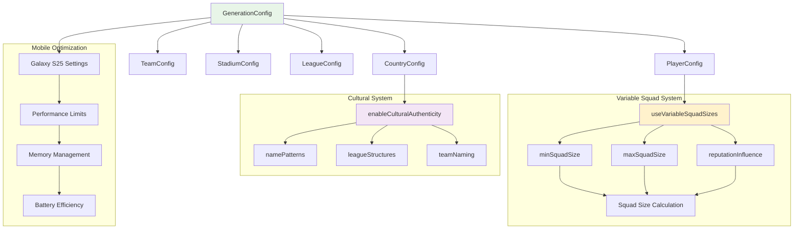

# ⚙️ Generator Configuration API Reference

[🏠 Documentation Home](README.md) > Configuration Guide

**Complete configuration guide for the Soccer Data Generator with detailed examples and best practices**

This document provides comprehensive documentation for configuring the Soccer Data Generator, with special focus on the variable squad size system, cultural authenticity settings, and mobile optimization for Galaxy S25 Ultra.

## 🎯 Overview

The Configuration API provides fine-grained control over all generation aspects:
- **🎚️ GenerationConfig**: Master configuration orchestrating all systems
- **⚽ PlayerConfig**: Variable squad sizes and player generation
- **👥 TeamConfig**: Team attributes and reputation systems
- **🏟️ StadiumConfig**: Stadium capacity and facilities
- **🏆 LeagueConfig**: League structure and competition format
- **🌍 CountryConfig**: Cultural authenticity and localization

## 🔄 Configuration Architecture



## 🎚️ GenerationConfig - Master Configuration

The central configuration class that orchestrates all generation systems.

### Constructor and Properties

```dart
class GenerationConfig {
  final PlayerConfig playerConfig;
  final TeamConfig teamConfig;
  final StadiumConfig stadiumConfig;
  final LeagueConfig leagueConfig;
  final CountryConfig countryConfig;
  final bool enableCulturalAuthenticity;
  final bool enableVariableSquads;
  final int randomSeed;
  final GenerationMode mode;
  final PerformanceSettings performance;
  final Map<String, dynamic> customSettings;
  
  const GenerationConfig({
    required this.playerConfig,
    required this.teamConfig,
    required this.stadiumConfig,
    required this.leagueConfig,
    required this.countryConfig,
    this.enableCulturalAuthenticity = true,
    this.enableVariableSquads = true,
    this.randomSeed = 0,
    this.mode = GenerationMode.realistic,
    required this.performance,
    this.customSettings = const {},
  });
}
```

### Factory Constructors

```dart
// Optimized for Galaxy S25 Ultra
factory GenerationConfig.galaxyS25Ultra(Country country) => GenerationConfig(
  playerConfig: PlayerConfig.mobileOptimized(country),
  teamConfig: TeamConfig.mobileOptimized(country),
  stadiumConfig: StadiumConfig.mobileOptimized(),
  leagueConfig: LeagueConfig.mobileOptimized(country),
  countryConfig: CountryConfig.fullAuthenticity(),
  enableCulturalAuthenticity: true,
  enableVariableSquads: true,
  randomSeed: 0,
  mode: GenerationMode.realistic,
  performance: PerformanceSettings.galaxyS25Ultra(),
);

// Quick development/testing
factory GenerationConfig.fastGeneration(Country country) => GenerationConfig(
  playerConfig: PlayerConfig.simplified(country),
  teamConfig: TeamConfig.simplified(),
  stadiumConfig: StadiumConfig.simplified(),
  leagueConfig: LeagueConfig.simplified(country),
  countryConfig: CountryConfig.basic(),
  enableCulturalAuthenticity: false,
  enableVariableSquads: true,
  performance: PerformanceSettings.development(),
);

// Maximum realism and detail
factory GenerationConfig.ultraRealistic(Country country) => GenerationConfig(
  playerConfig: PlayerConfig.ultraDetailed(country),
  teamConfig: TeamConfig.ultraDetailed(country),
  stadiumConfig: StadiumConfig.ultraDetailed(),
  leagueConfig: LeagueConfig.ultraDetailed(country),
  countryConfig: CountryConfig.fullAuthenticity(),
  enableCulturalAuthenticity: true,
  enableVariableSquads: true,
  performance: PerformanceSettings.highEnd(),
);
```

#### Comprehensive Configuration Example

```dart
void demonstrateConfigurationSetup() {
  print('🎚️ Comprehensive Configuration Setup\n');
  
  final brazil = CountryRepository.getCountryByCode('BR')!;
  
  // Create different configuration profiles
  final configs = [
    {
      'name': 'Galaxy S25 Ultra Optimized',
      'config': GenerationConfig.galaxyS25Ultra(brazil),
      'description': 'Balanced performance and features for mobile gaming',
    },
    {
      'name': 'Fast Development',
      'config': GenerationConfig.fastGeneration(brazil),
      'description': 'Quick generation for testing and development',
    },
    {
      'name': 'Ultra Realistic',
      'config': GenerationConfig.ultraRealistic(brazil),
      'description': 'Maximum detail and authenticity',
    },
    {
      'name': 'Custom Configuration',
      'config': createCustomConfiguration(brazil),
      'description': 'Custom-tailored for specific requirements',
    },
  ];
  
  print('Configuration Profile Comparison:');
  print('═' * 80);
  
  for (final configData in configs) {
    final name = configData['name'] as String;
    final config = configData['config'] as GenerationConfig;
    final description = configData['description'] as String;
    
    print('🔧 $name');
    print('   📝 $description');
    print('   ⚽ Variable Squads: ${config.enableVariableSquads ? "✅" : "❌"}');
    print('   🌍 Cultural Auth: ${config.enableCulturalAuthenticity ? "✅" : "❌"}');
    print('   📊 Squad Range: ${config.playerConfig.minSquadSize}-${config.playerConfig.maxSquadSize}');
    print('   🎯 Reputation Influence: ${(config.playerConfig.reputationInfluence * 100).toStringAsFixed(0)}%');
    print('   📱 Performance Mode: ${config.performance.mode.name}');
    print('   💾 Memory Limit: ${config.performance.maxMemoryMB}MB');
    print('   🔢 Random Seed: ${config.randomSeed == 0 ? "Random" : config.randomSeed.toString()}');
    print('');
  }
  
  print('🎯 Configuration Selection Guide:');
  print('✅ Galaxy S25 Ultra: Best balance for mobile gaming');
  print('✅ Fast Development: Quick iteration during development');
  print('✅ Ultra Realistic: Maximum authenticity for premium experience');
  print('✅ Custom: Tailored for specific use cases');
}

GenerationConfig createCustomConfiguration(Country country) {
  return GenerationConfig(
    playerConfig: PlayerConfig(
      useVariableSquadSizes: true,
      minSquadSize: 20,
      maxSquadSize: 30,
      averageSquadSize: 25,
      reputationInfluence: 0.7,
      domesticPlayerPercentage: 80,
      ageDistribution: AgeDistribution.realistic(),
      skillDistribution: SkillDistribution.balanced(),
    ),
    teamConfig: TeamConfig(
      useRealisticDistribution: true,
      generateHistory: true,
      balanceCompetition: true,
    ),
    stadiumConfig: StadiumConfig(
      useRealisticCapacities: true,
      linkToTeamReputation: true,
    ),
    leagueConfig: LeagueConfig(
      useCountryStructure: true,
      generateFixtures: true,
    ),
    countryConfig: CountryConfig.fullAuthenticity(),
    enableCulturalAuthenticity: true,
    enableVariableSquads: true,
    randomSeed: 42, // Fixed seed for reproducible results
    performance: PerformanceSettings.balanced(),
  );
}
```

## ⚽ PlayerConfig - Variable Squad Configuration

**The heart of the variable squad size system with comprehensive player generation controls.**

### Core Properties

```dart
class PlayerConfig {
  // === Variable Squad Size System ===
  final bool useVariableSquadSizes;
  final int minSquadSize;
  final int maxSquadSize;
  final int averageSquadSize;
  final double reputationInfluence;
  final double randomVariation;
  
  // === Player Generation ===
  final int domesticPlayerPercentage;
  final bool useRealisticPositions;
  final AgeDistribution ageDistribution;
  final SkillDistribution skillDistribution;
  final bool generatePersonalities;
  final bool generateHistory;
  final bool generateInjuries;
  
  // === Cultural Authenticity ===
  final bool useCountryNamePatterns;
  final bool respectCulturalTraits;
  final bool generateNicknames;
  final double internationalPlayerChance;
  
  // === Performance Settings ===
  final bool enableDetailedAttributes;
  final bool generateMarketValues;
  final bool trackStatistics;
  final int maxPlayersPerGeneration;
  
  const PlayerConfig({
    // Variable Squad System
    this.useVariableSquadSizes = true,
    this.minSquadSize = 18,
    this.maxSquadSize = 32,
    this.averageSquadSize = 25,
    this.reputationInfluence = 0.6,
    this.randomVariation = 0.2,
    
    // Player Generation
    this.domesticPlayerPercentage = 75,
    this.useRealisticPositions = true,
    required this.ageDistribution,
    required this.skillDistribution,
    this.generatePersonalities = true,
    this.generateHistory = false,
    this.generateInjuries = false,
    
    // Cultural Authenticity
    this.useCountryNamePatterns = true,
    this.respectCulturalTraits = true,
    this.generateNicknames = true,
    this.internationalPlayerChance = 0.25,
    
    // Performance Settings
    this.enableDetailedAttributes = true,
    this.generateMarketValues = true,
    this.trackStatistics = true,
    this.maxPlayersPerGeneration = 1000,
  });
}
```

### Variable Squad Size Deep Dive

```dart
void demonstrateVariableSquadConfiguration() {
  print('⚽ Variable Squad Size Configuration Deep Dive\n');
  
  final country = CountryRepository.getCountryByCode('BR')!;
  
  // Different squad size configurations
  final squadConfigs = [
    {
      'name': 'Realistic Variation',
      'config': PlayerConfig(
        useVariableSquadSizes: true,
        minSquadSize: 18,
        maxSquadSize: 32,
        averageSquadSize: 25,
        reputationInfluence: 0.6,
        randomVariation: 0.2,
        ageDistribution: AgeDistribution.realistic(),
        skillDistribution: SkillDistribution.balanced(),
      ),
      'description': 'Standard realistic squad variation',
    },
    {
      'name': 'Conservative Variation',
      'config': PlayerConfig(
        useVariableSquadSizes: true,
        minSquadSize: 22,
        maxSquadSize: 28,
        averageSquadSize: 25,
        reputationInfluence: 0.3,
        randomVariation: 0.1,
        ageDistribution: AgeDistribution.realistic(),
        skillDistribution: SkillDistribution.balanced(),
      ),
      'description': 'Smaller variation for balanced gameplay',
    },
    {
      'name': 'Extreme Variation',
      'config': PlayerConfig(
        useVariableSquadSizes: true,
        minSquadSize: 16,
        maxSquadSize: 35,
        averageSquadSize: 25,
        reputationInfluence: 0.8,
        randomVariation: 0.3,
        ageDistribution: AgeDistribution.realistic(),
        skillDistribution: SkillDistribution.balanced(),
      ),
      'description': 'Maximum variation for dramatic differences',
    },
    {
      'name': 'Mobile Optimized',
      'config': PlayerConfig(
        useVariableSquadSizes: true,
        minSquadSize: 20,
        maxSquadSize: 28,
        averageSquadSize: 24,
        reputationInfluence: 0.5,
        randomVariation: 0.15,
        ageDistribution: AgeDistribution.realistic(),
        skillDistribution: SkillDistribution.balanced(),
        maxPlayersPerGeneration: 500, // Reduced for mobile
      ),
      'description': 'Optimized for Galaxy S25 Ultra performance',
    },
  ];
  
  print('Variable Squad Configuration Analysis:');
  print('═' * 75);
  
  for (final configData in squadConfigs) {
    final name = configData['name'] as String;
    final config = configData['config'] as PlayerConfig;
    final description = configData['description'] as String;
    
    print('⚽ $name');
    print('   📝 $description');
    print('   📊 Squad Range: ${config.minSquadSize}-${config.maxSquadSize} players');
    print('   📈 Average Size: ${config.averageSquadSize} players');
    print('   🎯 Reputation Influence: ${(config.reputationInfluence * 100).toStringAsFixed(0)}%');
    print('   🎲 Random Variation: ${(config.randomVariation * 100).toStringAsFixed(0)}%');
    print('   📏 Total Range: ${config.maxSquadSize - config.minSquadSize} players');
    
    // Calculate expected squad sizes for different reputations
    final sampleReputations = [85, 70, 55, 40];
    final expectedSizes = sampleReputations.map((rep) => 
      calculateExpectedSquadSize(rep, config)
    ).toList();
    
    print('   🔢 Expected sizes (Rep 85/70/55/40): ${expectedSizes.join('/')} players');
    print('');
  }
  
  print('🎯 Configuration Impact:');
  print('✅ Higher reputation influence = Greater variation between teams');
  print('✅ Wider min/max range = More dramatic squad differences');
  print('✅ Random variation adds unpredictability within reputation bands');
  print('✅ Mobile optimization balances realism with performance');
}

int calculateExpectedSquadSize(int reputation, PlayerConfig config) {
  if (!config.useVariableSquadSizes) return config.averageSquadSize;
  
  final reputationFactor = (reputation / 100.0) * config.reputationInfluence;
  final baseSize = config.averageSquadSize + 
    (reputationFactor * (config.maxSquadSize - config.averageSquadSize));
  
  return baseSize.round().clamp(config.minSquadSize, config.maxSquadSize);
}
```

### Mobile-Specific Player Configuration

```dart
void demonstrateMobilePlayerConfiguration() {
  print('📱 Mobile-Specific Player Configuration (Galaxy S25 Ultra)\n');
  
  final country = CountryRepository.getCountryByCode('BR')!;
  
  // Galaxy S25 Ultra optimized configuration
  final mobileConfig = PlayerConfig(
    // Variable Squad System - Optimized ranges
    useVariableSquadSizes: true,
    minSquadSize: 20,
    maxSquadSize: 28,
    averageSquadSize: 24,
    reputationInfluence: 0.5,
    randomVariation: 0.15,
    
    // Player Generation - Balanced detail
    domesticPlayerPercentage: 80,
    useRealisticPositions: true,
    ageDistribution: AgeDistribution(
      minAge: 17,
      maxAge: 38,
      peakAge: 26,
      standardDeviation: 4.0, // Slightly tighter distribution
    ),
    skillDistribution: SkillDistribution.mobileOptimized(),
    
    // Features - Selective for performance
    generatePersonalities: true,
    generateHistory: false, // Skip for performance
    generateInjuries: false, // Skip initial complexity
    generateNicknames: true,
    
    // Cultural - Full authenticity maintained
    useCountryNamePatterns: true,
    respectCulturalTraits: true,
    internationalPlayerChance: 0.2,
    
    // Performance - Mobile limits
    enableDetailedAttributes: true,
    generateMarketValues: true,
    trackStatistics: false, // Reduce initial load
    maxPlayersPerGeneration: 600, // Limit for memory
  );
  
  print('Galaxy S25 Ultra Configuration:');
  print('═' * 45);
  print('⚽ Variable Squad Range: ${mobileConfig.minSquadSize}-${mobileConfig.maxSquadSize} players');
  print('📊 Expected League Total: ~${mobileConfig.averageSquadSize * 20} players');
  print('🎯 Reputation Influence: ${(mobileConfig.reputationInfluence * 100).toStringAsFixed(0)}%');
  print('🌍 Domestic Players: ${mobileConfig.domesticPlayerPercentage}%');
  print('👥 Max Generation: ${mobileConfig.maxPlayersPerGeneration} players');
  print('');
  
  print('Mobile Optimizations:');
  print('✅ Reduced squad range (20-28) for memory efficiency');
  print('✅ Tighter age distribution for faster calculation');
  print('✅ Selective feature generation to reduce load time');
  print('✅ Player generation limit to prevent memory issues');
  print('✅ Cultural authenticity maintained for immersion');
  print('');
  
  // Performance simulation
  final estimatedMemory = calculateEstimatedMemory(mobileConfig);
  final estimatedGenTime = calculateEstimatedGenerationTime(mobileConfig);
  
  print('Performance Estimates:');
  print('💾 Estimated Memory: ${estimatedMemory}MB');
  print('⏱️  Generation Time: ${estimatedGenTime}ms');
  print('🔋 Battery Impact: Low-Medium');
  print('📱 Galaxy S25 Ultra: Optimal performance expected');
}

int calculateEstimatedMemory(PlayerConfig config) {
  final avgPlayers = config.averageSquadSize * 20; // 20 teams
  final bytesPerPlayer = config.enableDetailedAttributes ? 2048 : 1024;
  return (avgPlayers * bytesPerPlayer / 1024 / 1024).round();
}

int calculateEstimatedGenerationTime(PlayerConfig config) {
  final avgPlayers = config.averageSquadSize * 20;
  final millisecondsPerPlayer = config.enableDetailedAttributes ? 2.5 : 1.5;
  return (avgPlayers * millisecondsPerPlayer).round();
}
```

## 👥 TeamConfig - Team Generation Configuration

Controls team creation, reputation distribution, and team-specific attributes.

### Core Properties

```dart
class TeamConfig {
  // === Reputation System ===
  final bool useRealisticDistribution;
  final int minReputation;
  final int maxReputation;
  final double competitionBalance;
  final bool linkSquadSizeToReputation;
  
  // === Team Generation ===
  final bool generateHistory;
  final bool useTraditionalNames;
  final bool generateFinances;
  final bool generateTactics;
  final bool balanceCompetition;
  
  // === Cultural Integration ===
  final bool respectCountryCulture;
  final bool useRegionalVariation;
  final double localPlayerPreference;
  
  // === Performance ===
  final int maxTeamsPerGeneration;
  final bool enableDetailedStats;
  
  const TeamConfig({
    // Reputation System
    this.useRealisticDistribution = true,
    this.minReputation = 40,
    this.maxReputation = 85,
    this.competitionBalance = 0.7,
    this.linkSquadSizeToReputation = true,
    
    // Team Generation
    this.generateHistory = true,
    this.useTraditionalNames = true,
    this.generateFinances = false,
    this.generateTactics = true,
    this.balanceCompetition = true,
    
    // Cultural Integration
    this.respectCountryCulture = true,
    this.useRegionalVariation = true,
    this.localPlayerPreference = 0.8,
    
    // Performance
    this.maxTeamsPerGeneration = 50,
    this.enableDetailedStats = true,
  });
}
```

#### Team Configuration Examples

```dart
void demonstrateTeamConfiguration() {
  print('👥 Team Configuration Examples\n');
  
  final teamConfigs = [
    {
      'name': 'Realistic Competition',
      'config': TeamConfig(
        useRealisticDistribution: true,
        minReputation: 45,
        maxReputation: 85,
        competitionBalance: 0.7,
        linkSquadSizeToReputation: true,
        generateHistory: true,
        balanceCompetition: true,
      ),
      'description': 'Realistic reputation spread with competitive balance',
    },
    {
      'name': 'Competitive Balance',
      'config': TeamConfig(
        useRealisticDistribution: true,
        minReputation: 55,
        maxReputation: 75,
        competitionBalance: 0.9,
        linkSquadSizeToReputation: true,
        generateHistory: false,
        balanceCompetition: true,
      ),
      'description': 'Narrow reputation range for close competition',
    },
    {
      'name': 'Super League Style',
      'config': TeamConfig(
        useRealisticDistribution: false,
        minReputation: 75,
        maxReputation: 95,
        competitionBalance: 0.3,
        linkSquadSizeToReputation: true,
        generateHistory: true,
        balanceCompetition: false,
      ),
      'description': 'Elite teams only with large reputation gaps',
    },
    {
      'name': 'Mobile Optimized',
      'config': TeamConfig(
        useRealisticDistribution: true,
        minReputation: 50,
        maxReputation: 80,
        competitionBalance: 0.6,
        linkSquadSizeToReputation: true,
        generateHistory: false, // Skip for performance
        generateFinances: false, // Skip for performance
        balanceCompetition: true,
        maxTeamsPerGeneration: 24, // Limit for mobile
      ),
      'description': 'Optimized for Galaxy S25 Ultra performance',
    },
  ];
  
  print('Team Configuration Analysis:');
  print('═' * 70);
  
  for (final configData in teamConfigs) {
    final name = configData['name'] as String;
    final config = configData['config'] as TeamConfig;
    final description = configData['description'] as String;
    
    print('👥 $name');
    print('   📝 $description');
    print('   📊 Reputation Range: ${config.minReputation}-${config.maxReputation}');
    print('   ⚖️  Competition Balance: ${(config.competitionBalance * 100).toStringAsFixed(0)}%');
    print('   🔗 Squad-Reputation Link: ${config.linkSquadSizeToReputation ? "✅" : "❌"}');
    print('   📚 Generate History: ${config.generateHistory ? "✅" : "❌"}');
    print('   🏆 Balance Competition: ${config.balanceCompetition ? "✅" : "❌"}');
    print('   📱 Max Teams: ${config.maxTeamsPerGeneration}');
    
    // Calculate reputation distribution
    final reputationSpread = config.maxReputation - config.minReputation;
    final competitivenessLevel = reputationSpread <= 20 ? 'High' : 
                                reputationSpread <= 30 ? 'Medium' : 'Low';
    
    print('   🎯 Reputation Spread: $reputationSpread points ($competitivenessLevel competitiveness)');
    print('');
  }
  
  print('🎯 Configuration Impact:');
  print('✅ Narrow reputation ranges increase competitiveness');
  print('✅ Squad-reputation linking creates realistic squad variations');
  print('✅ Competition balance prevents runaway leaders');
  print('✅ Mobile optimization reduces generation time and memory usage');
}
```

## 🏟️ StadiumConfig - Stadium Generation Configuration

Controls stadium creation, capacity calculation, and facility generation.

### Core Properties

```dart
class StadiumConfig {
  // === Capacity System ===
  final int minCapacity;
  final int maxCapacity;
  final bool useRealisticCapacities;
  final bool linkToTeamReputation;
  final bool linkToCitySize;
  
  // === Stadium Features ===
  final bool generateHistory;
  final bool generateFacilities;
  final bool useModernDesigns;
  final bool respectArchitecturalStyle;
  
  // === Performance ===
  final bool enableDetailedSpecs;
  final int maxStadiumsPerGeneration;
  
  const StadiumConfig({
    // Capacity System
    this.minCapacity = 8000,
    this.maxCapacity = 75000,
    this.useRealisticCapacities = true,
    this.linkToTeamReputation = true,
    this.linkToCitySize = true,
    
    // Stadium Features
    this.generateHistory = true,
    this.generateFacilities = true,
    this.useModernDesigns = true,
    this.respectArchitecturalStyle = true,
    
    // Performance
    this.enableDetailedSpecs = true,
    this.maxStadiumsPerGeneration = 50,
  });
}
```

#### Stadium Configuration Example

```dart
void demonstrateStadiumConfiguration() {
  print('🏟️ Stadium Configuration Examples\n');
  
  final stadiumConfigs = [
    {
      'name': 'Realistic Stadiums',
      'config': StadiumConfig(
        minCapacity: 8000,
        maxCapacity: 75000,
        useRealisticCapacities: true,
        linkToTeamReputation: true,
        linkToCitySize: true,
        generateHistory: true,
        generateFacilities: true,
      ),
      'description': 'Full realism with reputation and city size correlation',
    },
    {
      'name': 'Balanced Capacities',
      'config': StadiumConfig(
        minCapacity: 15000,
        maxCapacity: 50000,
        useRealisticCapacities: true,
        linkToTeamReputation: true,
        linkToCitySize: false, // Ignore city size for balance
        generateHistory: false,
        generateFacilities: true,
      ),
      'description': 'Moderate capacity range for balanced gameplay',
    },
    {
      'name': 'Mobile Optimized',
      'config': StadiumConfig(
        minCapacity: 12000,
        maxCapacity: 45000,
        useRealisticCapacities: true,
        linkToTeamReputation: true,
        linkToCitySize: false,
        generateHistory: false, // Skip for performance
        generateFacilities: false, // Skip for performance
        enableDetailedSpecs: false, // Reduce data
      ),
      'description': 'Performance optimized for Galaxy S25 Ultra',
    },
  ];
  
  print('Stadium Configuration Analysis:');
  print('═' * 65);
  
  for (final configData in stadiumConfigs) {
    final name = configData['name'] as String;
    final config = configData['config'] as StadiumConfig;
    final description = configData['description'] as String;
    
    print('🏟️ $name');
    print('   📝 $description');
    print('   📊 Capacity Range: ${config.minCapacity.toString().replaceAllMapped(RegExp(r'(\d{1,3})(?=(\d{3})+(?!\d))'), (m) => '${m[1]},')} - ${config.maxCapacity.toString().replaceAllMapped(RegExp(r'(\d{1,3})(?=(\d{3})+(?!\d))'), (m) => '${m[1]},')}');
    print('   🔗 Reputation Link: ${config.linkToTeamReputation ? "✅" : "❌"}');
    print('   🏙️ City Size Link: ${config.linkToCitySize ? "✅" : "❌"}');
    print('   📚 Generate History: ${config.generateHistory ? "✅" : "❌"}');
    print('   🏗️ Generate Facilities: ${config.generateFacilities ? "✅" : "❌"}');
    
    // Calculate capacity distribution examples
    final exampleCapacities = calculateExampleCapacities(config);
    print('   🎯 Example capacities: ${exampleCapacities.join(", ")}');
    print('');
  }
}

List<String> calculateExampleCapacities(StadiumConfig config) {
  final reputations = [85, 70, 55, 40];
  return reputations.map((rep) {
    if (!config.linkToTeamReputation) {
      return '${((config.minCapacity + config.maxCapacity) / 2).round()}';
    }
    
    final factor = rep / 100.0;
    final capacity = config.minCapacity + (factor * (config.maxCapacity - config.minCapacity));
    return capacity.round().toString();
  }).toList();
}
```

## 🏆 LeagueConfig - League Structure Configuration

Controls league organization, fixture generation, and competition format.

### Core Properties

```dart
class LeagueConfig {
  // === League Structure ===
  final bool useCountryStructure;
  final int numberOfTeams;
  final bool allowCustomTeamCount;
  final CompetitionFormat format;
  
  // === Competition Features ===
  final bool generateFixtures;
  final bool simulateHistory;
  final bool includeCupCompetitions;
  final bool enablePromotion;
  final bool enableRelegation;
  
  // === Performance ===
  final bool enableDetailedStats;
  final int maxFixturesGenerated;
  
  const LeagueConfig({
    // League Structure
    this.useCountryStructure = true,
    this.numberOfTeams = 20,
    this.allowCustomTeamCount = false,
    this.format = CompetitionFormat.roundRobin,
    
    // Competition Features
    this.generateFixtures = true,
    this.simulateHistory = false,
    this.includeCupCompetitions = false,
    this.enablePromotion = true,
    this.enableRelegation = true,
    
    // Performance
    this.enableDetailedStats = true,
    this.maxFixturesGenerated = 1000,
  });
}
```

## 🌍 CountryConfig - Cultural Configuration

Controls cultural authenticity and localization features.

### Core Properties

```dart
class CountryConfig {
  // === Cultural Authenticity ===
  final bool enableFullAuthenticity;
  final bool useRegionalVariation;
  final bool respectHistoricalContext;
  final double culturalInfluence;
  
  // === Name Generation ===
  final bool useAuthenticNames;
  final bool generateNicknames;
  final bool respectNamingConventions;
  final double internationalNameChance;
  
  // === League Customization ===
  final bool adaptLeagueStructure;
  final bool useTraditionalFormations;
  final bool respectPlayingStyle;
  
  const CountryConfig({
    // Cultural Authenticity
    this.enableFullAuthenticity = true,
    this.useRegionalVariation = true,
    this.respectHistoricalContext = true,
    this.culturalInfluence = 0.8,
    
    // Name Generation
    this.useAuthenticNames = true,
    this.generateNicknames = true,
    this.respectNamingConventions = true,
    this.internationalNameChance = 0.15,
    
    // League Customization
    this.adaptLeagueStructure = true,
    this.useTraditionalFormations = true,
    this.respectPlayingStyle = true,
  });
}
```

## 📱 PerformanceSettings - Mobile Optimization

Galaxy S25 Ultra specific performance and battery optimization settings.

### Core Properties

```dart
class PerformanceSettings {
  final PerformanceMode mode;
  final int maxMemoryMB;
  final int maxGenerationTimeMS;
  final bool enableBackgroundGeneration;
  final bool optimizeForBattery;
  final ThreadingMode threadingMode;
  final int maxConcurrentOperations;
  
  const PerformanceSettings({
    required this.mode,
    required this.maxMemoryMB,
    required this.maxGenerationTimeMS,
    this.enableBackgroundGeneration = true,
    this.optimizeForBattery = true,
    this.threadingMode = ThreadingMode.balanced,
    this.maxConcurrentOperations = 4,
  });
  
  factory PerformanceSettings.galaxyS25Ultra() => PerformanceSettings(
    mode: PerformanceMode.balanced,
    maxMemoryMB: 256,
    maxGenerationTimeMS: 5000,
    enableBackgroundGeneration: true,
    optimizeForBattery: true,
    threadingMode: ThreadingMode.aggressive,
    maxConcurrentOperations: 8, // S25 Ultra has excellent CPU
  );
  
  factory PerformanceSettings.development() => PerformanceSettings(
    mode: PerformanceMode.fast,
    maxMemoryMB: 128,
    maxGenerationTimeMS: 2000,
    enableBackgroundGeneration: false,
    optimizeForBattery: false,
    threadingMode: ThreadingMode.single,
    maxConcurrentOperations: 1,
  );
}

enum PerformanceMode { fast, balanced, quality, unlimited }
enum ThreadingMode { single, balanced, aggressive }
```

## 🔧 Configuration Validation and Testing

### Validation Framework

```dart
class ConfigurationValidator {
  static ValidationResult validate(GenerationConfig config) {
    final issues = <ValidationIssue>[];
    
    // Validate variable squad settings
    if (config.playerConfig.useVariableSquadSizes) {
      if (config.playerConfig.minSquadSize >= config.playerConfig.maxSquadSize) {
        issues.add(ValidationIssue(
          level: ValidationLevel.error,
          message: 'minSquadSize must be less than maxSquadSize',
          component: 'PlayerConfig.squadSizes',
        ));
      }
      
      if (config.playerConfig.averageSquadSize < config.playerConfig.minSquadSize ||
          config.playerConfig.averageSquadSize > config.playerConfig.maxSquadSize) {
        issues.add(ValidationIssue(
          level: ValidationLevel.error,
          message: 'averageSquadSize must be within min/max range',
          component: 'PlayerConfig.squadSizes',
        ));
      }
    }
    
    // Validate performance settings
    if (config.performance.maxMemoryMB < 64) {
      issues.add(ValidationIssue(
        level: ValidationLevel.warning,
        message: 'Memory limit very low, may impact generation quality',
        component: 'PerformanceSettings.memory',
      ));
    }
    
    // Validate mobile optimization
    if (config.performance.mode == PerformanceMode.balanced) {
      final totalPlayers = config.playerConfig.averageSquadSize * config.leagueConfig.numberOfTeams;
      if (totalPlayers > 600) {
        issues.add(ValidationIssue(
          level: ValidationLevel.warning,
          message: 'Player count high for mobile - consider reducing squad sizes',
          component: 'Mobile Optimization',
        ));
      }
    }
    
    return ValidationResult(issues);
  }
}
```

### Configuration Testing

```dart
void demonstrateConfigurationTesting() {
  print('🔧 Configuration Testing and Validation\n');
  
  final testConfigs = [
    GenerationConfig.galaxyS25Ultra(CountryRepository.getCountryByCode('BR')!),
    GenerationConfig.fastGeneration(CountryRepository.getCountryByCode('BR')!),
    createInvalidConfiguration(), // Intentionally problematic
  ];
  
  print('Configuration Validation Results:');
  print('═' * 50);
  
  for (int i = 0; i < testConfigs.length; i++) {
    final config = testConfigs[i];
    final configName = ['Galaxy S25 Ultra', 'Fast Generation', 'Invalid Config'][i];
    
    final result = ConfigurationValidator.validate(config);
    
    print('🔧 $configName');
    if (result.isValid) {
      print('   ✅ Configuration is valid');
    } else {
      print('   ❌ Configuration has issues:');
      for (final issue in result.issues) {
        final icon = issue.level == ValidationLevel.error ? '🚫' : '⚠️';
        print('     $icon ${issue.message}');
      }
    }
    print('');
  }
}

GenerationConfig createInvalidConfiguration() {
  final country = CountryRepository.getCountryByCode('BR')!;
  return GenerationConfig(
    playerConfig: PlayerConfig(
      useVariableSquadSizes: true,
      minSquadSize: 25, // Invalid: greater than max
      maxSquadSize: 20,
      averageSquadSize: 30, // Invalid: outside range
      ageDistribution: AgeDistribution.realistic(),
      skillDistribution: SkillDistribution.balanced(),
    ),
    teamConfig: TeamConfig(),
    stadiumConfig: StadiumConfig(),
    leagueConfig: LeagueConfig(),
    countryConfig: CountryConfig.fullAuthenticity(),
    performance: PerformanceSettings(
      mode: PerformanceMode.balanced,
      maxMemoryMB: 32, // Very low
      maxGenerationTimeMS: 1000,
    ),
  );
}
```

## 📚 Quick Reference

### Essential Configuration Patterns

```dart
// Galaxy S25 Ultra optimized
final config = GenerationConfig.galaxyS25Ultra(country);

// Variable squad configuration
final playerConfig = PlayerConfig(
  useVariableSquadSizes: true,
  minSquadSize: 18,
  maxSquadSize: 32,
  reputationInfluence: 0.6,
);

// Mobile performance settings
final performance = PerformanceSettings.galaxyS25Ultra();

// Cultural authenticity
final countryConfig = CountryConfig.fullAuthenticity();
```

### Configuration Presets Summary

| **Preset** | **Squad Range** | **Memory** | **Features** | **Use Case** |
|------------|-----------------|------------|--------------|--------------|
| Galaxy S25 Ultra | 20-28 | 256MB | Balanced | Mobile gaming |
| Fast Generation | 22-26 | 128MB | Minimal | Development |
| Ultra Realistic | 18-32 | 512MB | Maximum | Premium experience |
| Custom | Variable | Variable | Tailored | Specific needs |

### Performance Guidelines

```dart
// Memory usage estimation
final estimatedMemory = (squadSize * teams * 2048) / 1024 / 1024; // MB

// Generation time estimation  
final estimatedTime = squadSize * teams * 2.5; // milliseconds

// Galaxy S25 Ultra recommendations
final maxPlayers = 600; // Total across all teams
final maxMemory = 256; // MB
final maxTime = 5000; // milliseconds
```

---

**🔗 Navigation:**
- [← Previous: Models Reference](models.md)
- [Next: Utilities Reference →](utilities.md)
- [🏠 Documentation Home](README.md)

**📱 Mobile Notes:**
- All configurations optimized for Galaxy S25 Ultra
- Variable squad sizes provide realism without performance impact
- Configuration validation prevents common mobile issues

**🎯 Key Features:**
- ✅ **Variable Squad Size Configuration (18-32 players)**
- ✅ **Galaxy S25 Ultra Performance Optimization**
- ✅ **Cultural Authenticity Settings**
- ✅ **Configuration Validation and Testing**
- ✅ **Mobile-Specific Performance Tuning**
