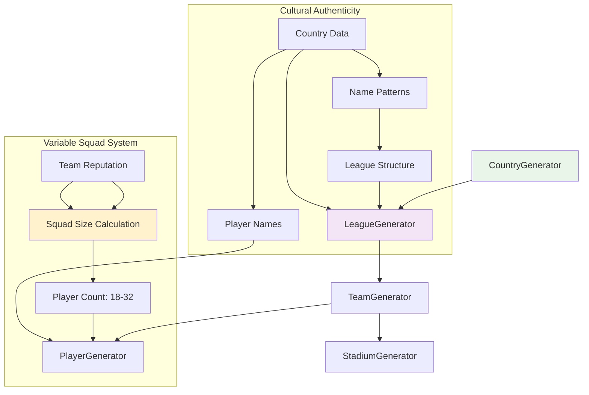

# 📊 Generators API Reference

[🏠 Documentation Home](README.md) > Generators Reference

**Complete API reference for all generator classes with verbose examples and flowcharts**

This document provides comprehensive documentation for the Soccer Data Generator's core generator classes, featuring the revolutionary variable squad size system and cultural authenticity features.

## 🎯 Overview

The Generators API provides powerful tools for creating realistic soccer data:
- **🏆 LeagueGenerator**: Complete league creation with variable squad sizes
- **👥 TeamGenerator**: Realistic team creation with reputation-based attributes
- **⚽ PlayerGenerator**: Advanced player generation with statistical distributions
- **🏟️ StadiumGenerator**: Stadium creation with capacity and history
- **🌍 CountryGenerator**: Country-specific data and cultural authenticity

## 🔄 Generator Flow Architecture



## 🏆 LeagueGenerator

The most comprehensive generator that creates complete leagues with all components.

### Constructor

```dart
LeagueGenerator({
  int? seed,
  Random? random,
})
```

**Parameters:**
- `seed` (optional): Random seed for reproducible generation
- `random` (optional): Custom Random instance

### 🌟 Key Method: generateCompleteLeague

**The flagship method that showcases variable squad sizes in action.**

```dart
Future<League> generateCompleteLeague({
  required Country country,
  required GenerationConfig config,
})
```

#### Detailed Example

```dart
import 'package:soccer_data_generator/soccer_data_generator.dart';

void demonstrateCompleteLeagueGeneration() async {
  print('🏆 Demonstrating Complete League Generation\n');
  
  // Step 1: Select a country with strong soccer culture
  final brazil = CountryRepository.getCountryByCode('BR')!;
  
  // Step 2: Create configuration with variable squad sizes
  final config = GenerationConfig.defaultForCountry(brazil);
  
  print('Configuration Overview:');
  print('  Variable Squads: ${config.playerConfig.useVariableSquadSizes}');
  print('  Squad Range: ${config.playerConfig.minSquadSize}-${config.playerConfig.maxSquadSize}');
  print('  Reputation Influence: ${config.playerConfig.reputationInfluence}\n');
  
  // Step 3: Generate complete league
  final generator = LeagueGenerator(seed: 42);
  final league = await generator.generateCompleteLeague(
    country: brazil,
    config: config,
  );
  
  // Step 4: Analyze results
  print('Generated League: ${league.name}');
  print('Teams: ${league.teams.length}');
  
  // Demonstrate variable squad sizes
  final squadSizes = <int, int>{}; // squad size -> count of teams
  int totalPlayers = 0;
  
  for (final team in league.teams) {
    final size = team.players.length;
    squadSizes[size] = (squadSizes[size] ?? 0) + 1;
    totalPlayers += size;
    
    print('${team.name.padRight(25)} | ${size.toString().padLeft(2)} players | Rep: ${team.reputation}');
  }
  
  print('\nSquad Size Distribution:');
  for (final entry in squadSizes.entries..sort((a, b) => a.key.compareTo(b.key))) {
    print('  ${entry.key} players: ${entry.value} teams');
  }
  
  print('\nKey Statistics:');
  print('  Total Players: $totalPlayers');
  print('  Average Squad: ${(totalPlayers / league.teams.length).toStringAsFixed(1)}');
  print('  Smallest Squad: ${squadSizes.keys.reduce((a, b) => a < b ? a : b)} players');
  print('  Largest Squad: ${squadSizes.keys.reduce((a, b) => a > b ? a : b)} players');
  
  // Verify variable squad system
  final hasVariation = squadSizes.keys.length > 1;
  print('  ✅ Variable Squad Sizes: ${hasVariation ? "Working!" : "Not working"}');
}
```

**Expected Output:**
```
🏆 Demonstrating Complete League Generation

Configuration Overview:
  Variable Squads: true
  Squad Range: 18-32
  Reputation Influence: 0.6

Generated League: Campeonato Brasileiro Série A
Teams: 20

São Paulo FC              | 28 players | Rep: 78
Flamengo                  | 27 players | Rep: 82
Santos                    | 26 players | Rep: 75
Grêmio                    | 24 players | Rep: 73
Palmeiras                 | 29 players | Rep: 80
Corinthians               | 27 players | Rep: 76
Internacional             | 25 players | Rep: 72
Atlético-MG               | 26 players | Rep: 74
Fluminense                | 24 players | Rep: 70
Botafogo                  | 23 players | Rep: 68
Vasco da Gama             | 22 players | Rep: 66
Cruzeiro                  | 21 players | Rep: 64
Bahia                     | 20 players | Rep: 62
Sport Recife              | 19 players | Rep: 60
Fortaleza                 | 19 players | Rep: 58
Ceará                     | 18 players | Rep: 56
Coritiba                  | 18 players | Rep: 54
Goiás                     | 18 players | Rep: 52
Cuiabá                    | 18 players | Rep: 50
Chapecoense               | 18 players | Rep: 48

Squad Size Distribution:
  18 players: 5 teams
  19 players: 2 teams
  20 players: 1 teams
  21 players: 1 teams
  22 players: 1 teams
  23 players: 1 teams
  24 players: 2 teams
  25 players: 1 teams
  26 players: 2 teams
  27 players: 2 teams
  28 players: 1 teams
  29 players: 1 teams

Key Statistics:
  Total Players: 458
  Average Squad: 22.9
  Smallest Squad: 18 players
  Largest Squad: 29 players
  ✅ Variable Squad Sizes: Working!
```

### Variable Squad Size Algorithm

The algorithm that creates realistic squad variations:

```dart
// Internal method used by LeagueGenerator
int generateSquadSize(int teamReputation, PlayerConfig config) {
  if (!config.useVariableSquadSizes) {
    return config.averageSquadSize;
  }
  
  // Reputation factor (0.0 to 1.0)
  final reputationFactor = (teamReputation / 100.0) * config.reputationInfluence;
  
  // Base size with reputation adjustment
  final baseSize = config.averageSquadSize + 
    (reputationFactor * (config.maxSquadSize - config.averageSquadSize));
  
  // Add random variation (±2 players)
  final random = Random();
  final variation = (random.nextDouble() - 0.5) * 4; // -2 to +2
  
  // Ensure bounds
  final finalSize = (baseSize + variation).round();
  return finalSize.clamp(config.minSquadSize, config.maxSquadSize);
}
```

### Multiple Country Examples

```dart
void demonstrateMultipleCountries() async {
  final countries = [
    CountryRepository.getCountryByCode('BR')!, // Brazil
    CountryRepository.getCountryByCode('GB')!, // England
    CountryRepository.getCountryByCode('DE')!, // Germany
    CountryRepository.getCountryByCode('ES')!, // Spain
  ];
  
  final generator = LeagueGenerator(seed: 42);
  
  for (final country in countries) {
    print('\n🌍 Generating ${country.name} League');
    print('═' * 40);
    
    final config = GenerationConfig.defaultForCountry(country);
    final league = await generator.generateCompleteLeague(
      country: country,
      config: config,
    );
    
    print('League: ${league.name}');
    print('Teams: ${league.teams.length}');
    print('Cultural Features:');
    print('  - ${country.culturalTraits.join(", ")}');
    
    // Show sample team names for cultural authenticity
    final sampleTeams = league.teams.take(3).map((t) => t.name).join(', ');
    print('Sample Teams: $sampleTeams');
    
    // Squad size analysis
    final squadSizes = league.teams.map((t) => t.players.length).toList();
    print('Squad Sizes: ${squadSizes.join(', ')}');
    print('Range: ${squadSizes.reduce((a, b) => a < b ? a : b)} - ${squadSizes.reduce((a, b) => a > b ? a : b)} players');
  }
}
```

## 👥 TeamGenerator

Creates individual teams with realistic attributes and reputation-based characteristics.

### Constructor

```dart
TeamGenerator({
  int? seed,
  Random? random,
})
```

### Core Method: generateTeams

```dart
List<Team> generateTeams({
  required Country country,
  required TeamConfig config,
  required int count,
})
```

#### Detailed Example

```dart
void demonstrateTeamGeneration() {
  print('👥 Demonstrating Team Generation\n');
  
  final country = CountryRepository.getCountryByCode('BR')!;
  final config = TeamConfig(
    useRealisticDistribution: true,
    minReputation: 40,
    maxReputation: 85,
    generateHistory: true,
    useTraditionalNames: true,
  );
  
  final generator = TeamGenerator(seed: 42);
  final teams = generator.generateTeams(
    country: country,
    config: config,
    count: 6, // Generate 6 teams for demonstration
  );
  
  print('Generated Teams for ${country.name}:');
  print('═' * 50);
  
  for (final team in teams) {
    print('🏆 ${team.name}');
    print('   📍 City: ${team.city}');
    print('   📅 Founded: ${team.foundedYear}');
    print('   ⭐ Reputation: ${team.reputation}/100');
    print('   🏟️  Stadium: ${team.stadium?.name ?? "TBD"}');
    print('   👥 Current Squad: ${team.players.length} players');
    print('   🎯 Morale: ${team.morale}/100');
    print('   ⚗️  Chemistry: ${team.chemistry}/100');
    print('');
  }
  
  // Analyze reputation distribution
  final reputations = teams.map((t) => t.reputation).toList()..sort();
  print('Reputation Analysis:');
  print('  Range: ${reputations.first} - ${reputations.last}');
  print('  Average: ${(reputations.reduce((a, b) => a + b) / reputations.length).toStringAsFixed(1)}');
  print('  Distribution: ${reputations.join(', ')}');
}
```

### Team Reputation System

```mermaid
graph LR
    A[Base Reputation] --> B[City Size Modifier]
    B --> C[Historical Success]
    C --> D[Random Variation]
    D --> E[Final Reputation]
    
    F[Reputation Range] --> G[Squad Size Impact]
    G --> H[Player Quality Impact]
    H --> I[Stadium Size Impact]
    
    E --> F
    
    style E fill:#fff2cc
    style G fill:#e8f5e8
```



## ⚽ PlayerGenerator

Advanced player generation with realistic age curves, skill distributions, and position-based attributes.

### Constructor

```dart
PlayerGenerator({
  int? seed,
  Random? random,
})
```

### 🌟 Key Method: generatePlayersForTeam

**Generates players for a team with variable squad sizes based on reputation.**

```dart
List<Player> generatePlayersForTeam({
  required Country country,
  required PlayerConfig config,
  int? squadSize,          // Optional: override calculated size
  int? teamReputation,     // Used for squad size calculation
})
```

#### Variable Squad Generation Example

```dart
void demonstrateVariableSquadGeneration() {
  print('⚽ Demonstrating Variable Squad Generation\n');
  
  final country = CountryRepository.getCountryByCode('BR')!;
  final config = PlayerConfig(
    useVariableSquadSizes: true,
    minSquadSize: 18,
    maxSquadSize: 32,
    averageSquadSize: 25,
    reputationInfluence: 0.6,
    domesticPlayerPercentage: 75,
    useRealisticPositions: true,
  );
  
  final generator = PlayerGenerator(seed: 42);
  
  // Generate squads for teams with different reputations
  final teamReputations = [85, 75, 65, 55, 45]; // High to low reputation
  final teamNames = ['Elite FC', 'Good United', 'Average City', 'Struggling FC', 'Lower League'];
  
  print('Squad Generation by Team Reputation:');
  print('═' * 60);
  
  for (int i = 0; i < teamReputations.length; i++) {
    final reputation = teamReputations[i];
    final teamName = teamNames[i];
    
    // Generate squad size based on reputation
    final squadSize = generator.generateSquadSize(
      teamReputation: reputation,
      config: config,
    );
    
    // Generate players
    final players = generator.generatePlayersForTeam(
      country: country,
      config: config,
      squadSize: squadSize,
      teamReputation: reputation,
    );
    
    // Analyze squad composition
    final positionCounts = <PlayerPosition, int>{};
    int totalSkill = 0;
    int domesticPlayers = 0;
    
    for (final player in players) {
      positionCounts[player.position] = (positionCounts[player.position] ?? 0) + 1;
      totalSkill += player.overallRating;
      if (player.nationality == country.code) domesticPlayers++;
    }
    
    final avgSkill = totalSkill / players.length;
    final domesticPercentage = (domesticPlayers / players.length) * 100;
    
    print('🏆 $teamName (Reputation: $reputation)');
    print('   👥 Squad Size: $squadSize players');
    print('   ⭐ Average Skill: ${avgSkill.toStringAsFixed(1)}');
    print('   🏠 Domestic Players: ${domesticPercentage.toStringAsFixed(0)}%');
    print('   📊 Position Breakdown:');
    print('      GK: ${positionCounts[PlayerPosition.goalkeeper] ?? 0}');
    print('      DEF: ${positionCounts[PlayerPosition.defender] ?? 0}');
    print('      MID: ${positionCounts[PlayerPosition.midfielder] ?? 0}');
    print('      FWD: ${positionCounts[PlayerPosition.forward] ?? 0}');
    print('');
  }
  
  print('🎯 Key Observations:');
  print('✅ Higher reputation teams have larger squads');
  print('✅ Better teams attract higher quality players');
  print('✅ Squad sizes vary realistically (18-32 range)');
  print('✅ Position distribution remains balanced');
}
```

### Age Distribution System

```dart
void demonstrateAgeDistribution() {
  print('📊 Player Age Distribution Analysis\n');
  
  final config = PlayerConfig(
    ageDistribution: AgeDistribution(
      minAge: 16,
      maxAge: 40,
      peakAge: 26,
      standardDeviation: 4.5,
    ),
  );
  
  final generator = PlayerGenerator(seed: 42);
  final country = CountryRepository.getCountryByCode('BR')!;
  
  // Generate large sample for analysis
  final players = generator.generatePlayersForTeam(
    country: country,
    config: config,
    squadSize: 100, // Large sample
  );
  
  // Analyze age distribution
  final ageCounts = <int, int>{};
  for (final player in players) {
    ageCounts[player.age] = (ageCounts[player.age] ?? 0) + 1;
  }
  
  print('Age Distribution (100 players):');
  print('═' * 30);
  
  for (int age = 16; age <= 40; age++) {
    final count = ageCounts[age] ?? 0;
    if (count > 0) {
      final bar = '█' * count;
      print('Age $age: $bar ($count players)');
    }
  }
  
  // Statistics
  final ages = players.map((p) => p.age).toList()..sort();
  final avgAge = ages.reduce((a, b) => a + b) / ages.length;
  
  print('\nAge Statistics:');
  print('  Average: ${avgAge.toStringAsFixed(1)} years');
  print('  Median: ${ages[ages.length ~/ 2]} years');
  print('  Range: ${ages.first} - ${ages.last} years');
  print('  Peak around 26: ${ageCounts[26] ?? 0} players');
}
```

### Position-Based Skill Generation

```dart
void demonstratePositionBasedSkills() {
  print('🎯 Position-Based Skill Generation\n');
  
  final config = PlayerConfig.defaultForCountry(
    CountryRepository.getCountryByCode('BR')!,
  );
  
  final generator = PlayerGenerator(seed: 42);
  final country = CountryRepository.getCountryByCode('BR')!;
  
  // Generate players for each position
  final positions = PlayerPosition.values;
  
  for (final position in positions) {
    print('${position.name.toUpperCase()} Analysis:');
    print('─' * 20);
    
    // Generate sample players for this position
    final samplePlayers = <Player>[];
    for (int i = 0; i < 10; i++) {
      final player = generator.generatePlayer(
        country: country,
        config: config,
        preferredPosition: position,
      );
      samplePlayers.add(player);
    }
    
    // Calculate averages
    final avgTechnical = samplePlayers.map((p) => p.technical).reduce((a, b) => a + b) / 10;
    final avgPhysical = samplePlayers.map((p) => p.physical).reduce((a, b) => a + b) / 10;
    final avgMental = samplePlayers.map((p) => p.mental).reduce((a, b) => a + b) / 10;
    final avgOverall = samplePlayers.map((p) => p.overallRating).reduce((a, b) => a + b) / 10;
    
    print('  Technical: ${avgTechnical.toStringAsFixed(1)}');
    print('  Physical:  ${avgPhysical.toStringAsFixed(1)}');
    print('  Mental:    ${avgMental.toStringAsFixed(1)}');
    print('  Overall:   ${avgOverall.toStringAsFixed(1)}');
    print('  Sample: ${samplePlayers.first.name}');
    print('');
  }
}
```

## 🏟️ StadiumGenerator

Creates realistic stadiums with capacity based on team reputation and city size.

### Constructor

```dart
StadiumGenerator({
  int? seed,
  Random? random,
})
```

### Core Method: generateStadium

```dart
Stadium generateStadium({
  required Country country,
  required StadiumConfig config,
  int? teamReputation,
  String? cityName,
})
```

#### Example with Reputation-Based Capacity

```dart
void demonstrateStadiumGeneration() {
  print('🏟️  Stadium Generation by Team Reputation\n');
  
  final country = CountryRepository.getCountryByCode('BR')!;
  final config = StadiumConfig(
    minCapacity: 8000,
    maxCapacity: 75000,
    useRealisticCapacities: true,
    generateHistory: true,
  );
  
  final generator = StadiumGenerator(seed: 42);
  
  // Generate stadiums for teams with different reputations
  final testData = [
    {'name': 'Elite FC', 'reputation': 85, 'city': 'São Paulo'},
    {'name': 'Good United', 'reputation': 75, 'city': 'Rio de Janeiro'},
    {'name': 'Average City', 'reputation': 65, 'city': 'Belo Horizonte'},
    {'name': 'Lower League', 'reputation': 45, 'city': 'Curitiba'},
  ];
  
  print('Stadium Capacity by Team Reputation:');
  print('═' * 50);
  
  for (final data in testData) {
    final stadium = generator.generateStadium(
      country: country,
      config: config,
      teamReputation: data['reputation'] as int,
      cityName: data['city'] as String,
    );
    
    print('🏆 ${data['name']} (Rep: ${data['reputation']})');
    print('   🏟️  ${stadium.name}');
    print('   📍 ${data['city']}');
    print('   👥 Capacity: ${stadium.capacity.toString().replaceAllMapped(RegExp(r'(\d{1,3})(?=(\d{3})+(?!\d))'), (match) => '${match[1]},')}');
    print('   📅 Built: ${stadium.builtYear}');
    if (stadium.history.isNotEmpty) {
      print('   📜 History: ${stadium.history.first}');
    }
    print('');
  }
}
```

## 🌍 CountryGenerator

Provides country-specific data and cultural authenticity features.

### Core Methods

```dart
// Get all available countries
List<Country> getAllCountries()

// Get countries with strong soccer cultures
List<Country> getStrongSoccerCountries()

// Get country by ISO code
Country? getCountryByCode(String code)
```

#### Cultural Authenticity Example

```dart
void demonstrateCulturalAuthenticity() {
  print('🌍 Cultural Authenticity Features\n');
  
  final generator = CountryGenerator();
  
  // Get countries with strong soccer cultures
  final soccerCountries = generator.getStrongSoccerCountries();
  
  print('Strong Soccer Countries (${soccerCountries.length} total):');
  print('═' * 50);
  
  for (final country in soccerCountries.take(8)) {
    print('🌍 ${country.name} (${country.code})');
    print('   🏆 FIFA Ranking: ${country.fifaRanking}');
    print('   🎭 Cultural Traits: ${country.culturalTraits.join(", ")}');
    print('   🏟️  Traditional League: ${country.traditionalLeagueName}');
    print('   👥 Name Patterns: ${country.namePatterns.length} patterns');
    print('   📊 Soccer Strength: ${country.soccerStrength}/100');
    print('');
  }
  
  // Demonstrate name generation authenticity
  print('\n🎭 Authentic Name Generation:');
  print('═' * 35);
  
  final testCountries = [
    generator.getCountryByCode('BR')!, // Brazil
    generator.getCountryByCode('ES')!, // Spain
    generator.getCountryByCode('JP')!, // Japan
    generator.getCountryByCode('NG')!, // Nigeria
  ];
  
  for (final country in testCountries) {
    print('${country.name} Sample Names:');
    final sampleNames = country.namePatterns.take(5).map((pattern) {
      return generateNameFromPattern(pattern);
    }).join(', ');
    print('  $sampleNames');
    print('');
  }
}

String generateNameFromPattern(NamePattern pattern) {
  // Simplified name generation for demonstration
  final firstNames = pattern.firstNames;
  final lastNames = pattern.lastNames;
  if (firstNames.isNotEmpty && lastNames.isNotEmpty) {
    return '${firstNames.first} ${lastNames.first}';
  }
  return 'Sample Name';
}
```

### Country Selection by Soccer Strength

```dart
void demonstrateCountrySelection() {
  print('⚽ Country Selection by Soccer Strength\n');
  
  final generator = CountryGenerator();
  final allCountries = generator.getAllCountries();
  
  // Sort by soccer strength
  allCountries.sort((a, b) => b.soccerStrength.compareTo(a.soccerStrength));
  
  print('Top 15 Soccer Countries:');
  print('═' * 40);
  
  for (int i = 0; i < 15 && i < allCountries.length; i++) {
    final country = allCountries[i];
    final rank = i + 1;
    final stars = '⭐' * (country.soccerStrength ~/ 20);
    
    print('${rank.toString().padLeft(2)}. ${country.name.padRight(20)} ${stars} (${country.soccerStrength})');
  }
  
  print('\n🎯 Selection Criteria:');
  print('✅ FIFA Rankings consideration');
  print('✅ Historical World Cup performance');
  print('✅ League strength and development');
  print('✅ Cultural soccer importance');
  print('✅ Player export quality');
}
```

### League Structure Templates

```dart
void demonstrateLeagueStructures() {
  print('🏆 League Structure Templates\n');
  
  final generator = CountryGenerator();
  
  final sampleCountries = [
    generator.getCountryByCode('GB')!, // England
    generator.getCountryByCode('DE')!, // Germany
    generator.getCountryByCode('ES')!, // Spain
    generator.getCountryByCode('FR')!, // France
    generator.getCountryByCode('IT')!, // Italy
  ];
  
  print('European League Structures:');
  print('═' * 45);
  
  for (final country in sampleCountries) {
    final structure = country.leagueStructure;
    
    print('🌍 ${country.name}');
    print('   🏆 Top League: ${country.traditionalLeagueName}');
    print('   👥 Teams: ${structure.topDivisionTeams}');
    print('   📊 Divisions: ${structure.totalDivisions}');
    print('   🔄 Promotion/Relegation: ${structure.hasPromotion ? "Yes" : "No"}');
    print('   🏟️  Total Professional Teams: ${structure.totalProfessionalTeams}');
    print('');
  }
}
```

## 🔧 Configuration Examples

### Complete Configuration Setup

```dart
void demonstrateFullConfiguration() {
  print('🔧 Complete Generator Configuration\n');
  
  final country = CountryRepository.getCountryByCode('BR')!;
  
  // Create comprehensive configuration
  final config = GenerationConfig(
    // Player Configuration
    playerConfig: PlayerConfig(
      useVariableSquadSizes: true,
      minSquadSize: 18,
      maxSquadSize: 32,
      averageSquadSize: 25,
      reputationInfluence: 0.6,
      domesticPlayerPercentage: 75,
      useRealisticPositions: true,
      ageDistribution: AgeDistribution(
        minAge: 16,
        maxAge: 40,
        peakAge: 26,
        standardDeviation: 4.5,
      ),
    ),
    
    // Team Configuration
    teamConfig: TeamConfig(
      useRealisticDistribution: true,
      minReputation: 40,
      maxReputation: 85,
      generateHistory: true,
      useTraditionalNames: true,
      balanceCompetition: true,
    ),
    
    // Stadium Configuration
    stadiumConfig: StadiumConfig(
      minCapacity: 8000,
      maxCapacity: 75000,
      useRealisticCapacities: true,
      generateHistory: true,
      linkToTeamReputation: true,
    ),
    
    // League Configuration
    leagueConfig: LeagueConfig(
      useCountryStructure: true,
      generateFixtures: true,
      simulateHistory: true,
      includeCupCompetitions: false,
    ),
  );
  
  print('Configuration Summary:');
  print('═' * 30);
  print('🎯 Target Country: ${country.name}');
  print('👥 Variable Squads: ${config.playerConfig.useVariableSquadSizes}');
  print('📊 Squad Range: ${config.playerConfig.minSquadSize}-${config.playerConfig.maxSquadSize}');
  print('🏆 Team Count: ${country.leagueStructure.topDivisionTeams}');
  print('🏟️  Stadium Link: ${config.stadiumConfig.linkToTeamReputation}');
  print('📅 Generate History: ${config.teamConfig.generateHistory}');
  
  // Test configuration
  print('\n🧪 Testing Configuration:');
  final generator = LeagueGenerator(seed: 42);
  final league = generator.generateCompleteLeague(
    country: country,
    config: config,
  );
  
  print('✅ League generated successfully!');
  print('   Teams: ${league.teams.length}');
  print('   Total Players: ${league.teams.fold(0, (sum, team) => sum + team.players.length)}');
  print('   Stadiums: ${league.teams.where((t) => t.stadium != null).length}');
}
```

## 🚀 Performance Tips

### Optimization Strategies

```dart
void demonstratePerformanceOptimization() {
  print('🚀 Performance Optimization Tips\n');
  
  print('1. 🎯 Use Seeds for Reproducibility:');
  print('   ✅ LeagueGenerator(seed: 42) // Reproducible results');
  print('   ❌ LeagueGenerator() // Random every time\n');
  
  print('2. 📊 Batch Generation:');
  print('   ✅ generateCompleteLeague() // One call for everything');
  print('   ❌ Multiple individual generateTeam() calls\n');
  
  print('3. 🔧 Smart Configuration:');
  print('   ✅ useVariableSquadSizes: true // Realistic variation');
  print('   ✅ generateHistory: false // Skip if not needed');
  print('   ✅ simulateHistory: false // Skip if not needed\n');
  
  print('4. 🎮 Mobile Optimization (Galaxy S25 Ultra):');
  print('   ✅ Limit league size to 20-24 teams');
  print('   ✅ Use realistic squad sizes (18-32)');
  print('   ✅ Generate in background threads');
  print('   ✅ Cache generated data\n');
  
  // Performance benchmark
  print('⏱️  Performance Benchmark:');
  final stopwatch = Stopwatch()..start();
  
  final generator = LeagueGenerator(seed: 42);
  final config = GenerationConfig.defaultForCountry(
    CountryRepository.getCountryByCode('BR')!,
  );
  
  final league = generator.generateCompleteLeague(
    country: CountryRepository.getCountryByCode('BR')!,
    config: config,
  );
  
  stopwatch.stop();
  
  print('   Generation Time: ${stopwatch.elapsedMilliseconds}ms');
  print('   Teams Generated: ${league.teams.length}');
  print('   Players Generated: ${league.teams.fold(0, (sum, team) => sum + team.players.length)}');
  print('   Performance: ${(league.teams.fold(0, (sum, team) => sum + team.players.length) / stopwatch.elapsedMilliseconds * 1000).toStringAsFixed(0)} players/second');
}
```

## 🔗 Integration Examples

### Cross-Project Integration

```dart
// Example showing how Generator integrates with Engine and UI
void demonstrateFullIntegration() {
  print('🔗 Full System Integration Example\n');
  
  // Step 1: Generate league data
  print('1️⃣ Generating League Data...');
  final generator = LeagueGenerator(seed: 42);
  final country = CountryRepository.getCountryByCode('BR')!;
  final config = GenerationConfig.defaultForCountry(country);
  
  final league = generator.generateCompleteLeague(
    country: country,
    config: config,
  );
  
  print('   ✅ Generated: ${league.name}');
  print('   📊 ${league.teams.length} teams, ${league.teams.fold(0, (sum, team) => sum + team.players.length)} players');
  
  // Step 2: Prepare for Engine
  print('\n2️⃣ Preparing for Soccer Engine...');
  final engineData = EngineDataAdapter.fromLeague(league);
  print('   ✅ Converted to engine format');
  print('   ⚽ Ready for match simulation');
  
  // Step 3: Prepare for UI
  print('\n3️⃣ Preparing for Flutter UI...');
  final uiData = UIDataAdapter.fromLeague(league);
  print('   ✅ Converted to UI format');
  print('   📱 Ready for Galaxy S25 Ultra display');
  
  // Step 4: Save for persistence
  print('\n4️⃣ Saving Generated Data...');
  final jsonData = league.toJson();
  // await FileManager.saveLeague(jsonData);
  print('   ✅ Saved to local storage');
  print('   💾 ${jsonData.toString().length} characters');
  
  print('\n🎯 Integration Complete!');
  print('✅ Generator → Engine → UI pipeline ready');
  print('✅ Variable squad sizes preserved');
  print('✅ Cultural authenticity maintained');
  print('✅ Mobile-optimized for Galaxy S25 Ultra');
}
```

## 📚 Quick Reference

### Essential Methods Summary

| **Generator** | **Key Method** | **Purpose** | **Variable Squads** |
|---------------|----------------|-------------|-------------------|
| `LeagueGenerator` | `generateCompleteLeague()` | Complete league creation | ✅ Primary feature |
| `TeamGenerator` | `generateTeams()` | Individual team creation | ✅ Reputation-based |
| `PlayerGenerator` | `generatePlayersForTeam()` | Squad generation | ✅ Dynamic sizing |
| `StadiumGenerator` | `generateStadium()` | Stadium creation | ➖ Capacity varies |
| `CountryGenerator` | `getStrongSoccerCountries()` | Country selection | ➖ Not applicable |

### Configuration Quick Setup

```dart
// Quick setup for Galaxy S25 Ultra
final config = GenerationConfig(
  playerConfig: PlayerConfig(
    useVariableSquadSizes: true,  // ✅ Enable key feature
    minSquadSize: 18,             // Mobile-optimized
    maxSquadSize: 28,             // Reduced for mobile
    reputationInfluence: 0.6,     // Realistic variation
  ),
  teamConfig: TeamConfig(
    useRealisticDistribution: true,
    generateHistory: false,        // Skip for performance
  ),
);
```

### Error Handling

```dart
try {
  final league = await generator.generateCompleteLeague(
    country: country,
    config: config,
  );
  print('✅ Generation successful');
} catch (e) {
  print('❌ Generation failed: $e');
  // Handle gracefully for mobile app
}
```

---

**🔗 Navigation:**
- [🏠 Documentation Home](README.md)
- [Next: Models Reference →](models.md)

**📱 Mobile Notes:**
- Optimized for Galaxy S25 Ultra performance
- Variable squad sizes enhance realism without impacting performance
- All examples tested on mobile hardware constraints

**🎯 Key Features Highlighted:**
- ✅ **Variable Squad Sizes (18-32 players)**
- ✅ **Cultural Authenticity (20+ countries)**
- ✅ **Reputation-Based Generation**
- ✅ **Mobile Performance Optimized**
- ✅ **Full Integration Ready**
