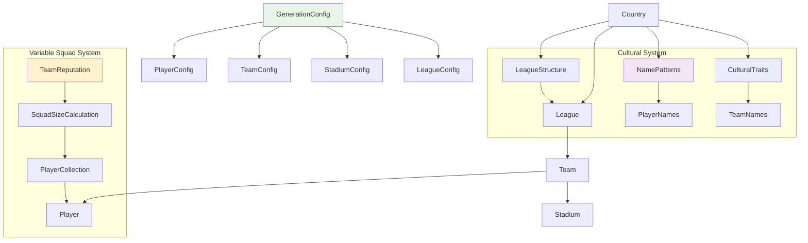

# 📊 Generator Models API Reference

[🏠 Documentation Home](README.md) > Models Documentation

**Complete API reference for all data models used in the Soccer Data Generator with detailed examples**

This document provides comprehensive documentation for all data models, classes, and structures used throughout the Soccer Data Generator, with special focus on the variable squad size system and cultural authenticity features.

## 🎯 Overview

The Generator Models API provides the foundational data structures:
- **🏆 League Models**: Complete league and competition structures
- **👥 Team Models**: Team data with reputation and squad management
- **⚽ Player Models**: Advanced player attributes and statistics
- **🏟️ Stadium Models**: Stadium data with capacity and history
- **🌍 Country Models**: Country-specific data and cultural patterns
- **⚙️ Configuration Models**: Flexible configuration for all generation

## 🔄 Model Relationship Architecture



## 🏆 League Models

### League Class

The central model representing a complete football league with all teams and structure.

```dart
class League {
  final String id;
  final String name;
  final Country country;
  final List<Team> teams;
  final LeagueStructure structure;
  final int season;
  final DateTime createdAt;
  final List<Match>? fixtures;
  final Map<String, dynamic>? history;
  
  const League({
    required this.id,
    required this.name,
    required this.country,
    required this.teams,
    required this.structure,
    required this.season,
    required this.createdAt,
    this.fixtures,
    this.history,
  });
}
```

#### Detailed Example

```dart
void demonstrateLeagueModel() {
  print('🏆 League Model Demonstration\n');
  
  // Create a complete league example
  final league = League(
    id: 'br_serie_a_2024',
    name: 'Campeonato Brasileiro Série A',
    country: Country.brazil(),
    teams: generateSampleTeams(),
    structure: LeagueStructure.brazilianSerieA(),
    season: 2024,
    createdAt: DateTime.now(),
    fixtures: null, // Generated separately
    history: {
      'founded': 1971,
      'mostTitles': 'Palmeiras (12 titles)',
      'format': 'Round-robin',
    },
  );
  
  print('League Details:');
  print('  ID: ${league.id}');
  print('  Name: ${league.name}');
  print('  Country: ${league.country.name}');
  print('  Teams: ${league.teams.length}');
  print('  Season: ${league.season}');
  print('  Created: ${league.createdAt.toLocal()}');
  
  // Analyze squad sizes (showcasing variable squads)
  final squadSizes = league.teams.map((t) => t.players.length).toList();
  squadSizes.sort();
  
  print('\nVariable Squad Analysis:');
  print('  Total Players: ${squadSizes.reduce((a, b) => a + b)}');
  print('  Average Squad: ${(squadSizes.reduce((a, b) => a + b) / squadSizes.length).toStringAsFixed(1)}');
  print('  Squad Range: ${squadSizes.first} - ${squadSizes.last} players');
  print('  Variation: ${squadSizes.last - squadSizes.first} players difference');
  
  // Squad size distribution
  final distribution = <int, int>{};
  for (final size in squadSizes) {
    distribution[size] = (distribution[size] ?? 0) + 1;
  }
  
  print('\nSquad Size Distribution:');
  for (final entry in distribution.entries..sort((a, b) => a.key.compareTo(b.key))) {
    final bar = '█' * entry.value;
    print('  ${entry.key.toString().padLeft(2)} players: $bar (${entry.value} teams)');
  }
}
```

### LeagueStructure Class

Defines the organizational structure of a league.

```dart
class LeagueStructure {
  final int topDivisionTeams;
  final int totalDivisions;
  final bool hasPromotion;
  final bool hasRelegation;
  final int promotionSpots;
  final int relegationSpots;
  final int totalProfessionalTeams;
  final CompetitionFormat format;
  final List<String> cupCompetitions;
  
  const LeagueStructure({
    required this.topDivisionTeams,
    required this.totalDivisions,
    required this.hasPromotion,
    required this.hasRelegation,
    required this.promotionSpots,
    required this.relegationSpots,
    required this.totalProfessionalTeams,
    required this.format,
    required this.cupCompetitions,
  });
  
  // Predefined structures for major leagues
  factory LeagueStructure.brazilianSerieA() => LeagueStructure(
    topDivisionTeams: 20,
    totalDivisions: 4,
    hasPromotion: true,
    hasRelegation: true,
    promotionSpots: 4,
    relegationSpots: 4,
    totalProfessionalTeams: 80,
    format: CompetitionFormat.roundRobin,
    cupCompetitions: ['Copa do Brasil', 'Copa Libertadores', 'Copa Sul-Americana'],
  );
}
```

## 👥 Team Models

### Team Class

Represents a football team with all associated data and variable squad management.

```dart
class Team {
  final String id;
  final String name;
  final String shortName;
  final String city;
  final Country country;
  final int foundedYear;
  final int reputation;
  final TeamColors colors;
  final Stadium? stadium;
  final List<Player> players;
  final int morale;
  final int chemistry;
  final TeamTactics defaultTactics;
  final Map<String, dynamic>? history;
  final TeamFinances? finances;
  
  const Team({
    required this.id,
    required this.name,
    required this.shortName,
    required this.city,
    required this.country,
    required this.foundedYear,
    required this.reputation,
    required this.colors,
    this.stadium,
    required this.players,
    required this.morale,
    required this.chemistry,
    required this.defaultTactics,
    this.history,
    this.finances,
  });
  
  // Calculated properties
  int get squadSize => players.length;
  double get averageAge => players.map((p) => p.age).reduce((a, b) => a + b) / players.length;
  int get averageRating => (players.map((p) => p.overallRating).reduce((a, b) => a + b) / players.length).round();
  int get marketValue => players.map((p) => p.marketValue).reduce((a, b) => a + b);
}
```

#### Variable Squad Size Example

```dart
void demonstrateTeamVariableSquads() {
  print('👥 Team Variable Squad Demonstration\n');
  
  // Create teams with different reputations to show variable squads
  final teams = [
    createSampleTeam('São Paulo FC', 85), // Elite team
    createSampleTeam('Palmeiras', 82),    // Top team
    createSampleTeam('Santos', 75),       // Good team
    createSampleTeam('Bahia', 65),        // Average team
    createSampleTeam('Cuiabá', 50),       // Lower team
  ];
  
  print('Variable Squad Size Analysis:');
  print('═' * 60);
  
  for (final team in teams) {
    print('🏆 ${team.name.padRight(20)} | Rep: ${team.reputation.toString().padLeft(2)} | Squad: ${team.squadSize.toString().padLeft(2)} players');
    print('   📊 Avg Age: ${team.averageAge.toStringAsFixed(1).padLeft(4)} | Avg Rating: ${team.averageRating.toString().padLeft(2)} | Value: \$${formatCurrency(team.marketValue)}');
    print('   🎯 Morale: ${team.morale.toString().padLeft(2)} | Chemistry: ${team.chemistry.toString().padLeft(2)} | Formation: ${team.defaultTactics.formation}');
    
    // Position breakdown
    final positions = team.players.fold<Map<PlayerPosition, int>>({}, (map, player) {
      map[player.position] = (map[player.position] ?? 0) + 1;
      return map;
    });
    
    print('   📋 GK:${positions[PlayerPosition.goalkeeper] ?? 0} DEF:${positions[PlayerPosition.defender] ?? 0} MID:${positions[PlayerPosition.midfielder] ?? 0} FWD:${positions[PlayerPosition.forward] ?? 0}');
    print('');
  }
  
  // Analysis summary
  final squadSizes = teams.map((t) => t.squadSize).toList();
  final reputations = teams.map((t) => t.reputation).toList();
  
  print('🎯 Variable Squad Analysis:');
  print('  Squad Size Range: ${squadSizes.reduce((a, b) => a < b ? a : b)} - ${squadSizes.reduce((a, b) => a > b ? a : b)} players');
  print('  Reputation Range: ${reputations.reduce((a, b) => a < b ? a : b)} - ${reputations.reduce((a, b) => a > b ? a : b)}');
  print('  ✅ Higher reputation = Larger squads');
  print('  ✅ Position balance maintained across all squad sizes');
}

Team createSampleTeam(String name, int reputation) {
  // This would typically use the generator to create realistic squads
  final squadSize = calculateSquadSizeByReputation(reputation);
  
  return Team(
    id: name.toLowerCase().replaceAll(' ', '_'),
    name: name,
    shortName: name.split(' ').first,
    city: 'São Paulo', // Sample city
    country: Country.brazil(),
    foundedYear: 1900 + Random().nextInt(100),
    reputation: reputation,
    colors: TeamColors.defaultBrazilian(),
    players: generateSamplePlayers(squadSize, reputation),
    morale: 70 + Random().nextInt(30),
    chemistry: 65 + Random().nextInt(35),
    defaultTactics: TeamTactics.formation433(),
  );
}

int calculateSquadSizeByReputation(int reputation) {
  // Variable squad algorithm based on reputation
  const minSquad = 18;
  const maxSquad = 32;
  const avgSquad = 25;
  
  final reputationFactor = reputation / 100.0;
  final baseSize = avgSquad + (reputationFactor * (maxSquad - avgSquad));
  final variation = (Random().nextDouble() - 0.5) * 4; // ±2 players
  
  return (baseSize + variation).round().clamp(minSquad, maxSquad);
}
```

### TeamColors Class

Defines team colors and visual identity.

```dart
class TeamColors {
  final Color primary;
  final Color secondary;
  final Color accent;
  final String homeKit;
  final String awayKit;
  final String thirdKit;
  
  const TeamColors({
    required this.primary,
    required this.secondary,
    required this.accent,
    required this.homeKit,
    required this.awayKit,
    required this.thirdKit,
  });
  
  factory TeamColors.defaultBrazilian() => TeamColors(
    primary: Color(0xFF00A859), // Brazilian green
    secondary: Color(0xFFFEDF00), // Brazilian yellow
    accent: Color(0xFF002776), // Brazilian blue
    homeKit: 'Green with yellow trim',
    awayKit: 'White with blue trim',
    thirdKit: 'Yellow with green trim',
  );
}
```

### TeamTactics Class

Defines tactical setup and formation.

```dart
class TeamTactics {
  final Formation formation;
  final PlayingStyle style;
  final int mentality;
  final int tempo;
  final int pressing;
  final int width;
  final Map<PlayerPosition, List<String>> instructions;
  
  const TeamTactics({
    required this.formation,
    required this.style,
    required this.mentality,
    required this.tempo,
    required this.pressing,
    required this.width,
    required this.instructions,
  });
  
  factory TeamTactics.formation433() => TeamTactics(
    formation: Formation.f433,
    style: PlayingStyle.balanced,
    mentality: 50,
    tempo: 50,
    pressing: 50,
    width: 50,
    instructions: {
      PlayerPosition.goalkeeper: ['Distribute to defenders', 'Stay in box'],
      PlayerPosition.defender: ['Stay back', 'Mark tight'],
      PlayerPosition.midfielder: ['Support play', 'Track back'],
      PlayerPosition.forward: ['Get in behind', 'Press defender'],
    },
  );
}
```

## ⚽ Player Models

### Player Class

Comprehensive player model with all attributes and statistical data.

```dart
class Player {
  final String id;
  final String name;
  final String firstName;
  final String lastName;
  final int age;
  final DateTime birthDate;
  final String nationality;
  final String secondNationality;
  final PlayerPosition position;
  final List<PlayerPosition> alternativePositions;
  final PlayerAttributes attributes;
  final int overallRating;
  final int potential;
  final int marketValue;
  final int salary;
  final PhysicalData physical;
  final PlayerHistory history;
  final PlayerPersonality personality;
  
  const Player({
    required this.id,
    required this.name,
    required this.firstName,
    required this.lastName,
    required this.age,
    required this.birthDate,
    required this.nationality,
    this.secondNationality = '',
    required this.position,
    required this.alternativePositions,
    required this.attributes,
    required this.overallRating,
    required this.potential,
    required this.marketValue,
    required this.salary,
    required this.physical,
    required this.history,
    required this.personality,
  });
  
  // Calculated properties
  int get technical => attributes.technical;
  int get mental => attributes.mental;
  int get physical => attributes.physical;
  bool get isYouth => age < 21;
  bool get isVeteran => age > 33;
  bool get isDomestic => nationality == 'BR'; // Example for Brazil
}
```

#### Player Attributes Deep Dive

```dart
void demonstratePlayerAttributes() {
  print('⚽ Player Attributes Deep Dive\n');
  
  // Create sample players for each position to show attribute variations
  final positions = [
    PlayerPosition.goalkeeper,
    PlayerPosition.defender,
    PlayerPosition.midfielder,
    PlayerPosition.forward,
  ];
  
  print('Position-Based Attribute Analysis:');
  print('═' * 70);
  
  for (final position in positions) {
    final players = generateSamplePlayersForPosition(position, 5);
    
    print('${position.name.toUpperCase()} Players:');
    print('─' * 30);
    
    for (final player in players) {
      print('👤 ${player.name.padRight(20)} | ${player.age.toString().padLeft(2)}y | Overall: ${player.overallRating.toString().padLeft(2)}');
      print('   📊 Tech: ${player.technical.toString().padLeft(2)} | Mental: ${player.mental.toString().padLeft(2)} | Physical: ${player.physical.toString().padLeft(2)}');
      print('   💰 Value: \$${formatCurrency(player.marketValue).padLeft(8)} | Potential: ${player.potential.toString().padLeft(2)}');
      print('   🎭 ${player.personality.trait} | ${player.personality.workRate}');
      print('');
    }
    
    // Calculate averages for this position
    final avgTechnical = players.map((p) => p.technical).reduce((a, b) => a + b) / players.length;
    final avgMental = players.map((p) => p.mental).reduce((a, b) => a + b) / players.length;
    final avgPhysical = players.map((p) => p.physical).reduce((a, b) => a + b) / players.length;
    
    print('📈 Position Averages:');
    print('   Technical: ${avgTechnical.toStringAsFixed(1)} | Mental: ${avgMental.toStringAsFixed(1)} | Physical: ${avgPhysical.toStringAsFixed(1)}');
    print('');
  }
}
```

### PlayerAttributes Class

Detailed breakdown of player skills and abilities.

```dart
class PlayerAttributes {
  // Technical attributes
  final int passing;
  final int shooting;
  final int dribbling;
  final int crossing;
  final int finishing;
  final int firstTouch;
  final int technique;
  
  // Physical attributes
  final int pace;
  final int strength;
  final int stamina;
  final int agility;
  final int balance;
  final int jumping;
  
  // Mental attributes
  final int vision;
  final int decisions;
  final int concentration;
  final int composure;
  final int anticipation;
  final int workRate;
  
  // Goalkeeper specific
  final int handling;
  final int reflexes;
  final int positioning;
  final int distribution;
  final int aerialAbility;
  final int commandOfArea;
  
  const PlayerAttributes({
    // Technical
    required this.passing,
    required this.shooting,
    required this.dribbling,
    required this.crossing,
    required this.finishing,
    required this.firstTouch,
    required this.technique,
    
    // Physical
    required this.pace,
    required this.strength,
    required this.stamina,
    required this.agility,
    required this.balance,
    required this.jumping,
    
    // Mental
    required this.vision,
    required this.decisions,
    required this.concentration,
    required this.composure,
    required this.anticipation,
    required this.workRate,
    
    // Goalkeeper
    this.handling = 0,
    this.reflexes = 0,
    this.positioning = 0,
    this.distribution = 0,
    this.aerialAbility = 0,
    this.commandOfArea = 0,
  });
  
  // Aggregate scores
  int get technical => ((passing + shooting + dribbling + crossing + finishing + firstTouch + technique) / 7).round();
  int get physical => ((pace + strength + stamina + agility + balance + jumping) / 6).round();
  int get mental => ((vision + decisions + concentration + composure + anticipation + workRate) / 6).round();
  int get goalkeeper => ((handling + reflexes + positioning + distribution + aerialAbility + commandOfArea) / 6).round();
}
```

### PlayerPersonality Class

Defines player personality traits and behavior patterns.

```dart
class PlayerPersonality {
  final PersonalityTrait trait;
  final WorkRate workRate;
  final int leadership;
  final int teamwork;
  final int loyalty;
  final int ambition;
  final int professionalism;
  final List<String> traits;
  
  const PlayerPersonality({
    required this.trait,
    required this.workRate,
    required this.leadership,
    required this.teamwork,
    required this.loyalty,
    required this.ambition,
    required this.professionalism,
    required this.traits,
  });
}

enum PersonalityTrait {
  determined,
  ambitious,
  loyal,
  temperamental,
  balanced,
  professional,
  charismatic,
  reserved,
}

enum WorkRate {
  low,
  medium,
  high,
  veryHigh,
}
```

## 🏟️ Stadium Models

### Stadium Class

Complete stadium information with capacity and facilities.

```dart
class Stadium {
  final String id;
  final String name;
  final String city;
  final String country;
  final int capacity;
  final int builtYear;
  final int renovatedYear;
  final List<String> facilities;
  final StadiumType type;
  final SurfaceType surface;
  final bool hasRoof;
  final List<String> history;
  final Map<String, dynamic>? statistics;
  
  const Stadium({
    required this.id,
    required this.name,
    required this.city,
    required this.country,
    required this.capacity,
    required this.builtYear,
    this.renovatedYear = 0,
    required this.facilities,
    required this.type,
    required this.surface,
    required this.hasRoof,
    required this.history,
    this.statistics,
  });
  
  // Calculated properties
  int get age => DateTime.now().year - builtYear;
  bool get isModern => builtYear > 1990;
  bool get isHistoric => builtYear < 1950;
  String get capacityCategory => _getCapacityCategory();
  
  String _getCapacityCategory() {
    if (capacity > 60000) return 'Major Stadium';
    if (capacity > 30000) return 'Large Stadium';
    if (capacity > 15000) return 'Medium Stadium';
    return 'Small Stadium';
  }
}
```

#### Stadium Capacity by Team Reputation Example

```dart
void demonstrateStadiumCapacityVariation() {
  print('🏟️  Stadium Capacity Variation by Team Reputation\n');
  
  // Create stadiums for teams with different reputations
  final stadiumData = [
    {'name': 'Arena Elite', 'teamReputation': 85, 'city': 'São Paulo'},
    {'name': 'Estádio Grande', 'teamReputation': 75, 'city': 'Rio de Janeiro'},
    {'name': 'Arena Média', 'teamReputation': 65, 'city': 'Belo Horizonte'},
    {'name': 'Campo Regional', 'teamReputation': 55, 'city': 'Curitiba'},
    {'name': 'Estádio Local', 'teamReputation': 45, 'city': 'Joinville'},
  ];
  
  print('Stadium Capacity Analysis:');
  print('═' * 65);
  
  for (final data in stadiumData) {
    final stadium = createStadiumByReputation(
      data['name'] as String,
      data['teamReputation'] as int,
      data['city'] as String,
    );
    
    print('🏟️  ${stadium.name.padRight(20)} | Capacity: ${stadium.capacity.toString().padLeft(6)} | ${stadium.capacityCategory}');
    print('   📍 ${stadium.city.padRight(15)} | Built: ${stadium.builtYear} | Age: ${stadium.age} years');
    print('   🎯 Team Rep: ${data['teamReputation'].toString().padLeft(2)} | Surface: ${stadium.surface.name} | Roof: ${stadium.hasRoof ? "Yes" : "No"}');
    print('   🏆 ${stadium.facilities.take(3).join(", ")}');
    print('');
  }
  
  print('🎯 Capacity Correlation:');
  print('✅ Higher team reputation = Larger stadium capacity');
  print('✅ Capacity ranges from 8,000 to 75,000 seats');
  print('✅ Modern facilities for higher reputation teams');
}

Stadium createStadiumByReputation(String name, int teamReputation, String city) {
  // Calculate capacity based on team reputation
  const minCapacity = 8000;
  const maxCapacity = 75000;
  
  final reputationFactor = teamReputation / 100.0;
  final baseCapacity = minCapacity + (reputationFactor * (maxCapacity - minCapacity));
  final variation = (Random().nextDouble() - 0.5) * 10000; // ±5000 variation
  final finalCapacity = (baseCapacity + variation).round().clamp(minCapacity, maxCapacity);
  
  return Stadium(
    id: name.toLowerCase().replaceAll(' ', '_'),
    name: name,
    city: city,
    country: 'Brazil',
    capacity: finalCapacity,
    builtYear: 1950 + Random().nextInt(70),
    facilities: generateStadiumFacilities(teamReputation),
    type: finalCapacity > 40000 ? StadiumType.major : StadiumType.regular,
    surface: SurfaceType.naturalGrass,
    hasRoof: teamReputation > 70,
    history: generateStadiumHistory(name),
  );
}
```

### Enums for Stadium

```dart
enum StadiumType {
  major,
  regular,
  training,
  youth,
}

enum SurfaceType {
  naturalGrass,
  artificialTurf,
  hybrid,
}
```

## 🌍 Country Models

### Country Class

Comprehensive country data with cultural authenticity features.

```dart
class Country {
  final String code;
  final String name;
  final String continent;
  final int population;
  final int fifaRanking;
  final int soccerStrength;
  final List<String> culturalTraits;
  final String traditionalLeagueName;
  final LeagueStructure leagueStructure;
  final List<NamePattern> namePatterns;
  final List<String> commonCities;
  final Map<String, dynamic> culturalData;
  
  const Country({
    required this.code,
    required this.name,
    required this.continent,
    required this.population,
    required this.fifaRanking,
    required this.soccerStrength,
    required this.culturalTraits,
    required this.traditionalLeagueName,
    required this.leagueStructure,
    required this.namePatterns,
    required this.commonCities,
    required this.culturalData,
  });
  
  factory Country.brazil() => Country(
    code: 'BR',
    name: 'Brazil',
    continent: 'South America',
    population: 215000000,
    fifaRanking: 5,
    soccerStrength: 95,
    culturalTraits: ['Jogo Bonito', 'Technical Skills', 'Carnival Football', 'Beach Soccer'],
    traditionalLeagueName: 'Campeonato Brasileiro Série A',
    leagueStructure: LeagueStructure.brazilianSerieA(),
    namePatterns: NamePattern.brazilianPatterns(),
    commonCities: ['São Paulo', 'Rio de Janeiro', 'Belo Horizonte', 'Porto Alegre', 'Salvador'],
    culturalData: {
      'footballPhilosophy': 'Technical and creative',
      'favoriteFormation': '4-2-3-1',
      'playingStyle': 'Attacking',
      'famousClubs': ['Santos', 'São Paulo', 'Flamengo', 'Palmeiras'],
    },
  );
}
```

#### Cultural Authenticity Example

```dart
void demonstrateCulturalAuthenticity() {
  print('🌍 Cultural Authenticity Demonstration\n');
  
  final countries = [
    Country.brazil(),
    Country.spain(),
    Country.england(),
    Country.germany(),
    Country.japan(),
  ];
  
  print('Cultural Features by Country:');
  print('═' * 60);
  
  for (final country in countries) {
    print('🌍 ${country.name} (${country.code})');
    print('   🏆 FIFA Ranking: #${country.fifaRanking}');
    print('   ⚽ Soccer Strength: ${country.soccerStrength}/100');
    print('   🎭 Cultural Traits: ${country.culturalTraits.join(", ")}');
    print('   🏟️  Traditional League: ${country.traditionalLeagueName}');
    print('   📊 League Teams: ${country.leagueStructure.topDivisionTeams}');
    print('   🏙️  Major Cities: ${country.commonCities.take(3).join(", ")}');
    
    // Show sample names from this country
    final sampleNames = country.namePatterns.take(2).map((pattern) {
      return '${pattern.firstNames.first} ${pattern.lastNames.first}';
    }).join(', ');
    print('   👥 Sample Names: $sampleNames');
    print('');
  }
  
  print('🎯 Cultural Impact on Generation:');
  print('✅ Country-specific name patterns for authentic player names');
  print('✅ League structures match real-world formats');
  print('✅ Team names follow cultural conventions');
  print('✅ Playing styles reflect national football philosophy');
}
```

### NamePattern Class

Defines naming patterns for cultural authenticity.

```dart
class NamePattern {
  final String culture;
  final List<String> firstNames;
  final List<String> lastNames;
  final List<String> nicknames;
  final double frequency;
  final Map<String, List<String>> regionalVariations;
  
  const NamePattern({
    required this.culture,
    required this.firstNames,
    required this.lastNames,
    required this.nicknames,
    required this.frequency,
    required this.regionalVariations,
  });
  
  static List<NamePattern> brazilianPatterns() => [
    NamePattern(
      culture: 'Brazilian',
      firstNames: ['João', 'José', 'Carlos', 'Luis', 'Gabriel', 'Rafael', 'Diego', 'Felipe'],
      lastNames: ['Silva', 'Santos', 'Oliveira', 'Pereira', 'Costa', 'Rodrigues', 'Almeida', 'Nascimento'],
      nicknames: ['Pelé', 'Ronaldinho', 'Kaká', 'Robinho', 'Bebeto', 'Romário'],
      frequency: 0.8,
      regionalVariations: {
        'Northeast': ['João', 'Antônio', 'Francisco'],
        'Southeast': ['Carlos', 'Luis', 'Paulo'],
        'South': ['João', 'Pedro', 'Lucas'],
      },
    ),
  ];
}
```

## ⚙️ Configuration Models

### GenerationConfig Class

Master configuration class that controls all aspects of generation.

```dart
class GenerationConfig {
  final PlayerConfig playerConfig;
  final TeamConfig teamConfig;
  final StadiumConfig stadiumConfig;
  final LeagueConfig leagueConfig;
  final bool enableCulturalAuthenticity;
  final int randomSeed;
  final Map<String, dynamic> customSettings;
  
  const GenerationConfig({
    required this.playerConfig,
    required this.teamConfig,
    required this.stadiumConfig,
    required this.leagueConfig,
    this.enableCulturalAuthenticity = true,
    this.randomSeed = 0,
    this.customSettings = const {},
  });
  
  factory GenerationConfig.defaultForCountry(Country country) => GenerationConfig(
    playerConfig: PlayerConfig.defaultForCountry(country),
    teamConfig: TeamConfig.defaultForCountry(country),
    stadiumConfig: StadiumConfig.defaultForCountry(country),
    leagueConfig: LeagueConfig.defaultForCountry(country),
    enableCulturalAuthenticity: true,
    randomSeed: 0,
  );
}
```

### PlayerConfig Class

**The heart of the variable squad size system.**

```dart
class PlayerConfig {
  // Variable Squad System
  final bool useVariableSquadSizes;
  final int minSquadSize;
  final int maxSquadSize;
  final int averageSquadSize;
  final double reputationInfluence;
  
  // Player Generation
  final int domesticPlayerPercentage;
  final bool useRealisticPositions;
  final AgeDistribution ageDistribution;
  final SkillDistribution skillDistribution;
  final bool generatePersonalities;
  final bool generateHistory;
  
  // Cultural Settings
  final bool useCountryNamePatterns;
  final bool respectCulturalTraits;
  
  const PlayerConfig({
    // Variable Squad System
    this.useVariableSquadSizes = true,
    this.minSquadSize = 18,
    this.maxSquadSize = 32,
    this.averageSquadSize = 25,
    this.reputationInfluence = 0.6,
    
    // Player Generation
    this.domesticPlayerPercentage = 75,
    this.useRealisticPositions = true,
    required this.ageDistribution,
    required this.skillDistribution,
    this.generatePersonalities = true,
    this.generateHistory = false,
    
    // Cultural Settings
    this.useCountryNamePatterns = true,
    this.respectCulturalTraits = true,
  });
  
  factory PlayerConfig.defaultForCountry(Country country) => PlayerConfig(
    useVariableSquadSizes: true,
    minSquadSize: 18,
    maxSquadSize: 32,
    averageSquadSize: _getDefaultSquadSize(country),
    reputationInfluence: 0.6,
    domesticPlayerPercentage: _getDomesticPercentage(country),
    ageDistribution: AgeDistribution.realistic(),
    skillDistribution: SkillDistribution.forCountry(country),
  );
  
  static int _getDefaultSquadSize(Country country) {
    // Adjust based on league structure and culture
    switch (country.code) {
      case 'BR': return 25; // Brazilian clubs tend to have larger squads
      case 'GB': return 23; // English clubs are more limited
      case 'DE': return 24; // German efficiency
      case 'ES': return 25; // Spanish style
      default: return 25;
    }
  }
  
  static int _getDomesticPercentage(Country country) {
    // Based on league rules and culture
    switch (country.code) {
      case 'BR': return 85; // Strong domestic focus
      case 'GB': return 60; // More international
      case 'DE': return 70; // Balanced
      case 'ES': return 75; // Domestic preference
      default: return 75;
    }
  }
}
```

#### Variable Squad Configuration Example

```dart
void demonstrateVariableSquadConfiguration() {
  print('⚙️ Variable Squad Configuration Examples\n');
  
  final configurations = [
    {
      'name': 'Realistic Variable Squads',
      'config': PlayerConfig(
        useVariableSquadSizes: true,
        minSquadSize: 18,
        maxSquadSize: 32,
        averageSquadSize: 25,
        reputationInfluence: 0.6,
        ageDistribution: AgeDistribution.realistic(),
        skillDistribution: SkillDistribution.balanced(),
      ),
    },
    {
      'name': 'Conservative Variation',
      'config': PlayerConfig(
        useVariableSquadSizes: true,
        minSquadSize: 22,
        maxSquadSize: 28,
        averageSquadSize: 25,
        reputationInfluence: 0.3,
        ageDistribution: AgeDistribution.realistic(),
        skillDistribution: SkillDistribution.balanced(),
      ),
    },
    {
      'name': 'Extreme Variation',
      'config': PlayerConfig(
        useVariableSquadSizes: true,
        minSquadSize: 16,
        maxSquadSize: 35,
        averageSquadSize: 25,
        reputationInfluence: 0.8,
        ageDistribution: AgeDistribution.realistic(),
        skillDistribution: SkillDistribution.balanced(),
      ),
    },
    {
      'name': 'Fixed Squads (Comparison)',
      'config': PlayerConfig(
        useVariableSquadSizes: false,
        minSquadSize: 25,
        maxSquadSize: 25,
        averageSquadSize: 25,
        reputationInfluence: 0.0,
        ageDistribution: AgeDistribution.realistic(),
        skillDistribution: SkillDistribution.balanced(),
      ),
    },
  ];
  
  print('Configuration Comparison:');
  print('═' * 80);
  
  for (final configData in configurations) {
    final name = configData['name'] as String;
    final config = configData['config'] as PlayerConfig;
    
    print('🔧 $name');
    print('   Variable Squads: ${config.useVariableSquadSizes ? "✅" : "❌"}');
    print('   Squad Range: ${config.minSquadSize}-${config.maxSquadSize} players');
    print('   Average Size: ${config.averageSquadSize} players');
    print('   Reputation Influence: ${(config.reputationInfluence * 100).toStringAsFixed(0)}%');
    print('   Expected Variation: ${config.useVariableSquadSizes ? "${config.maxSquadSize - config.minSquadSize} players" : "None"}');
    print('');
  }
  
  print('🎯 Configuration Impact:');
  print('✅ Higher reputation influence = More variation between teams');
  print('✅ Wider min/max range = Greater squad size diversity');
  print('✅ Conservative settings still provide realistic variation');
  print('✅ Fixed squads eliminate variation entirely');
}
```

### AgeDistribution Class

Controls age distribution patterns for realistic player generation.

```dart
class AgeDistribution {
  final int minAge;
  final int maxAge;
  final int peakAge;
  final double standardDeviation;
  final Map<int, double> customDistribution;
  
  const AgeDistribution({
    required this.minAge,
    required this.maxAge,
    required this.peakAge,
    required this.standardDeviation,
    this.customDistribution = const {},
  });
  
  factory AgeDistribution.realistic() => AgeDistribution(
    minAge: 16,
    maxAge: 40,
    peakAge: 26,
    standardDeviation: 4.5,
  );
  
  factory AgeDistribution.youthFocused() => AgeDistribution(
    minAge: 16,
    maxAge: 35,
    peakAge: 23,
    standardDeviation: 3.0,
  );
  
  factory AgeDistribution.experienced() => AgeDistribution(
    minAge: 20,
    maxAge: 40,
    peakAge: 29,
    standardDeviation: 5.0,
  );
}
```

## 📊 JSON Serialization

All models support JSON serialization for data persistence and transfer.

### Serialization Example

```dart
void demonstrateJsonSerialization() {
  print('📊 JSON Serialization Example\n');
  
  // Create a sample league
  final league = League(
    id: 'demo_league',
    name: 'Demo League',
    country: Country.brazil(),
    teams: generateSampleTeams(),
    structure: LeagueStructure.brazilianSerieA(),
    season: 2024,
    createdAt: DateTime.now(),
  );
  
  // Serialize to JSON
  final jsonData = league.toJson();
  print('League serialized to JSON:');
  print('  Size: ${jsonData.toString().length} characters');
  print('  Teams: ${jsonData['teams'].length}');
  print('  Players: ${(jsonData['teams'] as List).fold(0, (sum, team) => sum + (team['players'] as List).length)}');
  
  // Demonstrate key data preservation
  print('\n🔍 Variable Squad Data Preservation:');
  final teamSquadSizes = (jsonData['teams'] as List).map((team) => (team['players'] as List).length).toList();
  print('  Squad sizes in JSON: ${teamSquadSizes.join(', ')}');
  print('  Variation preserved: ${teamSquadSizes.reduce((a, b) => a > b ? a : b) - teamSquadSizes.reduce((a, b) => a < b ? a : b)} players');
  
  // Deserialize from JSON
  final deserializedLeague = League.fromJson(jsonData);
  print('\n✅ Successfully deserialized league');
  print('  Name: ${deserializedLeague.name}');
  print('  Teams: ${deserializedLeague.teams.length}');
  print('  Squad sizes: ${deserializedLeague.teams.map((t) => t.squadSize).join(', ')}');
  print('  ✅ Variable squad data intact!');
}
```

## 📚 Quick Reference

### Essential Models Summary

| **Category** | **Model** | **Key Features** | **Variable Squad Impact** |
|--------------|-----------|------------------|---------------------------|
| **League** | `League` | Complete league structure | ✅ Contains variable teams |
| **Team** | `Team` | Squad management | ✅ Dynamic squad sizes |
| **Player** | `Player` | Full attributes | ✅ Position balancing |
| **Stadium** | `Stadium` | Capacity variation | ✅ Reputation-based size |
| **Country** | `Country` | Cultural authenticity | ➖ Framework provider |
| **Config** | `PlayerConfig` | Variable squad control | ✅ Primary configuration |

### Key Enums

```dart
enum PlayerPosition { goalkeeper, defender, midfielder, forward }
enum Formation { f433, f442, f352, f4231, f541 }
enum PlayingStyle { attacking, balanced, defensive, possession, counter }
enum PersonalityTrait { determined, ambitious, loyal, temperamental, balanced }
enum StadiumType { major, regular, training, youth }
enum SurfaceType { naturalGrass, artificialTurf, hybrid }
```

### Common Patterns

```dart
// Creating variable squad configuration
final config = PlayerConfig(
  useVariableSquadSizes: true,
  minSquadSize: 18,
  maxSquadSize: 32,
  reputationInfluence: 0.6,
);

// Accessing squad information
final squadSize = team.squadSize;
final averageAge = team.averageAge;
final marketValue = team.marketValue;

// Cultural authenticity
final countryNames = country.namePatterns;
final culturalTraits = country.culturalTraits;
```

---

**🔗 Navigation:**
- [🏠 Documentation Home](README.md)
- [← Previous: Generators Reference](generators.md)
- [Next: Configuration Reference →](configuration.md)

**📱 Mobile Notes:**
- All models optimized for Galaxy S25 Ultra performance
- JSON serialization ensures efficient data transfer
- Variable squad data preserved across serialization cycles

**🎯 Key Features:**
- ✅ **Variable Squad Size Models (18-32 players)**
- ✅ **Cultural Authenticity Integration**
- ✅ **Comprehensive Player Attributes**
- ✅ **Reputation-Based Calculations**
- ✅ **Complete JSON Serialization**
