# 🛠️ Generator Utilities API Reference

[🏠 Documentation Home](README.md) > Utilities Reference

**Complete reference for utility classes, helpers, and support functions in the Soccer Data Generator**

This document provides comprehensive documentation for all utility classes, helper functions, data adapters, and support systems that power the Soccer Data Generator, with special focus on variable squad size calculations and mobile optimization.

## 🎯 Overview

The Utilities API provides essential support functions:
- **🧮 CalculationUtils**: Squad size calculations and mathematical helpers
- **🔄 DataAdapters**: Conversion between projects (Generator ↔ Engine ↔ UI)
- **📊 ValidationUtils**: Data validation and integrity checking
- **🎲 RandomUtils**: Seeded random generation and distribution
- **📱 MobileUtils**: Galaxy S25 Ultra specific optimizations
- **🌍 CulturalUtils**: Cultural authenticity and localization helpers

## 🔄 Utility Architecture

```mermaid
graph TD
    A[CalculationUtils] --> B[SquadSizeCalculator]
    A --> C[StatisticsCalculator]
    A --> D[ReputationCalculator]
    
    E[DataAdapters] --> F[EngineAdapter]
    E --> G[UIAdapter]
    E --> H[JSONAdapter]
    
    I[ValidationUtils] --> J[ConfigValidator]
    I --> K[DataValidator]
    I --> L[IntegrityChecker]
    
    M[RandomUtils] --> N[SeededRandom]
    M --> O[DistributionGenerator]
    M --> P[WeightedSelection]
    
    Q[MobileUtils] --> R[PerformanceOptimizer]
    Q --> S[MemoryManager]
    Q --> T[BatteryOptimizer]
    
    U[CulturalUtils] --> V[NameGenerator]
    U --> W[RegionMapper]
    U --> X[AuthenticityChecker]
    
    style B fill:#fff2cc
    style F fill:#e8f5e8
    style R fill:#f3e5f5
```



## 🧮 CalculationUtils - Mathematical Helpers

Core mathematical calculations for the variable squad size system and statistical distributions.

### SquadSizeCalculator

**The heart of the variable squad size algorithm.**

```dart
class SquadSizeCalculator {
  static int calculateSquadSize({
    required int teamReputation,
    required PlayerConfig config,
    Random? random,
  }) {
    if (!config.useVariableSquadSizes) {
      return config.averageSquadSize;
    }
    
    final rand = random ?? Random();
    
    // Step 1: Reputation influence
    final reputationFactor = (teamReputation / 100.0) * config.reputationInfluence;
    
    // Step 2: Base size calculation
    final baseSize = config.averageSquadSize + 
      (reputationFactor * (config.maxSquadSize - config.averageSquadSize));
    
    // Step 3: Random variation
    final variation = (rand.nextDouble() - 0.5) * 2 * config.randomVariation * config.averageSquadSize;
    
    // Step 4: Apply bounds
    final finalSize = (baseSize + variation).round();
    return finalSize.clamp(config.minSquadSize, config.maxSquadSize);
  }
  
  static SquadSizeDistribution calculateDistribution({
    required List<int> teamReputations,
    required PlayerConfig config,
    int? seed,
  }) {
    final random = seed != null ? Random(seed) : Random();
    final squadSizes = <int>[];
    final reputationToSquadMap = <int, int>{};
    
    for (final reputation in teamReputations) {
      final squadSize = calculateSquadSize(
        teamReputation: reputation,
        config: config,
        random: random,
      );
      squadSizes.add(squadSize);
      reputationToSquadMap[reputation] = squadSize;
    }
    
    return SquadSizeDistribution(
      squadSizes: squadSizes,
      reputationMapping: reputationToSquadMap,
      totalPlayers: squadSizes.reduce((a, b) => a + b),
      averageSquadSize: squadSizes.reduce((a, b) => a + b) / squadSizes.length,
      minSquadSize: squadSizes.reduce((a, b) => a < b ? a : b),
      maxSquadSize: squadSizes.reduce((a, b) => a > b ? a : b),
      variation: squadSizes.reduce((a, b) => a > b ? a : b) - squadSizes.reduce((a, b) => a < b ? a : b),
    );
  }
}
```

#### Squad Size Calculation Examples

```dart
void demonstrateSquadSizeCalculations() {
  print('🧮 Squad Size Calculation Examples\n');
  
  final config = PlayerConfig(
    useVariableSquadSizes: true,
    minSquadSize: 18,
    maxSquadSize: 32,
    averageSquadSize: 25,
    reputationInfluence: 0.6,
    randomVariation: 0.2,
    ageDistribution: AgeDistribution.realistic(),
    skillDistribution: SkillDistribution.balanced(),
  );
  
  // Test different reputation levels
  final testReputations = [90, 80, 70, 60, 50, 40];
  
  print('Squad Size Calculation by Reputation:');
  print('═' * 55);
  
  for (final reputation in testReputations) {
    print('🏆 Team Reputation: $reputation');
    
    // Calculate multiple times to show variation
    final squadSizes = <int>[];
    for (int i = 0; i < 10; i++) {
      final size = SquadSizeCalculator.calculateSquadSize(
        teamReputation: reputation,
        config: config,
        random: Random(42 + i), // Different seeds for variation
      );
      squadSizes.add(size);
    }
    
    final avgSize = squadSizes.reduce((a, b) => a + b) / squadSizes.length;
    final minSize = squadSizes.reduce((a, b) => a < b ? a : b);
    final maxSize = squadSizes.reduce((a, b) => a > b ? a : b);
    
    print('   📊 Squad sizes: ${squadSizes.join(', ')}');
    print('   📈 Average: ${avgSize.toStringAsFixed(1)} | Range: $minSize-$maxSize | Variation: ${maxSize - minSize}');
    print('');
  }
  
  // Demonstrate league-wide distribution
  print('📊 League-Wide Distribution (20 teams):');
  print('═' * 40);
  
  final teamReputations = List.generate(20, (i) => 45 + (i * 2)); // 45-83 reputation range
  final distribution = SquadSizeCalculator.calculateDistribution(
    teamReputations: teamReputations,
    config: config,
    seed: 42,
  );
  
  print('Total Players: ${distribution.totalPlayers}');
  print('Average Squad: ${distribution.averageSquadSize.toStringAsFixed(1)}');
  print('Squad Range: ${distribution.minSquadSize}-${distribution.maxSquadSize}');
  print('Total Variation: ${distribution.variation} players');
  
  // Show distribution histogram
  final sizeCounts = <int, int>{};
  for (final size in distribution.squadSizes) {
    sizeCounts[size] = (sizeCounts[size] ?? 0) + 1;
  }
  
  print('\nSquad Size Distribution:');
  for (final entry in sizeCounts.entries..sort((a, b) => a.key.compareTo(b.key))) {
    final bar = '█' * entry.value;
    print('${entry.key.toString().padLeft(2)} players: $bar (${entry.value} teams)');
  }
}
```

### StatisticsCalculator

Advanced statistical calculations for realistic data distribution.

```dart
class StatisticsCalculator {
  static double calculateNormalDistribution({
    required double mean,
    required double standardDeviation,
    required Random random,
  }) {
    // Box-Muller transformation for normal distribution
    static double? spare;
    
    if (spare != null) {
      final result = spare!;
      spare = null;
      return mean + standardDeviation * result;
    }
    
    final u = random.nextDouble();
    final v = random.nextDouble();
    final mag = standardDeviation * sqrt(-2.0 * log(u));
    spare = mag * cos(2.0 * pi * v);
    
    return mean + mag * sin(2.0 * pi * v);
  }
  
  static int calculateAgeDistribution({
    required AgeDistribution distribution,
    required Random random,
  }) {
    final normalAge = calculateNormalDistribution(
      mean: distribution.peakAge.toDouble(),
      standardDeviation: distribution.standardDeviation,
      random: random,
    );
    
    return normalAge.round().clamp(distribution.minAge, distribution.maxAge);
  }
  
  static List<int> generateReputationDistribution({
    required int teamCount,
    required int minReputation,
    required int maxReputation,
    required double competitionBalance,
    required Random random,
  }) {
    final reputations = <int>[];
    
    if (competitionBalance > 0.8) {
      // High competition balance - narrow range around middle
      final midPoint = (minReputation + maxReputation) / 2;
      final range = (maxReputation - minReputation) * (1.0 - competitionBalance);
      
      for (int i = 0; i < teamCount; i++) {
        final variation = (random.nextDouble() - 0.5) * range;
        final reputation = (midPoint + variation).round().clamp(minReputation, maxReputation);
        reputations.add(reputation);
      }
    } else {
      // Lower competition balance - wider distribution
      for (int i = 0; i < teamCount; i++) {
        final progress = i / (teamCount - 1);
        final baseReputation = minReputation + (progress * (maxReputation - minReputation));
        final variation = (random.nextDouble() - 0.5) * 10; // ±5 variation
        final reputation = (baseReputation + variation).round().clamp(minReputation, maxReputation);
        reputations.add(reputation);
      }
    }
    
    reputations.shuffle(random);
    return reputations;
  }
}
```

## 🔄 DataAdapters - Cross-Project Integration

Seamless conversion between Generator, Engine, and UI data formats.

### EngineAdapter

**Converts Generator data to Soccer Engine format for match simulation.**

```dart
class EngineAdapter {
  static EngineLeague fromGeneratorLeague(League league) {
    return EngineLeague(
      id: league.id,
      name: league.name,
      teams: league.teams.map((team) => fromGeneratorTeam(team)).toList(),
      season: league.season,
      structure: fromGeneratorStructure(league.structure),
    );
  }
  
  static EngineTeam fromGeneratorTeam(Team team) {
    return EngineTeam(
      id: team.id,
      name: team.name,
      reputation: team.reputation,
      players: team.players.map((player) => fromGeneratorPlayer(player)).toList(),
      tactics: fromGeneratorTactics(team.defaultTactics),
      morale: team.morale,
      chemistry: team.chemistry,
      stadium: team.stadium != null ? fromGeneratorStadium(team.stadium!) : null,
    );
  }
  
  static EnginePlayer fromGeneratorPlayer(Player player) {
    return EnginePlayer(
      id: player.id,
      name: player.name,
      age: player.age,
      position: convertPosition(player.position),
      overallRating: player.overallRating,
      attributes: EngineAttributes(
        technical: player.technical,
        physical: player.physical,
        mental: player.mental,
        // Map specific attributes for engine use
        pace: player.attributes.pace,
        shooting: player.attributes.shooting,
        passing: player.attributes.passing,
        defending: calculateDefending(player),
        dribbling: player.attributes.dribbling,
        physicality: calculatePhysicality(player),
      ),
      personality: EnginePersonality(
        aggression: convertPersonalityToEngine(player.personality),
        workRate: convertWorkRate(player.personality.workRate),
      ),
    );
  }
  
  static int calculateDefending(Player player) {
    // Calculate defending rating based on position and attributes
    if (player.position == PlayerPosition.defender) {
      return ((player.attributes.anticipation + player.attributes.concentration + 
               player.attributes.decisions) / 3).round();
    } else if (player.position == PlayerPosition.midfielder) {
      return ((player.attributes.anticipation + player.attributes.workRate) / 2).round();
    } else {
      return (player.attributes.workRate * 0.3).round();
    }
  }
  
  static int calculatePhysicality(Player player) {
    return ((player.attributes.strength + player.attributes.stamina + 
             player.attributes.jumping) / 3).round();
  }
}
```

#### Engine Adapter Example

```dart
void demonstrateEngineAdapter() {
  print('🔄 Engine Adapter Demonstration\n');
  
  // Create sample Generator league
  final generatorLeague = createSampleGeneratorLeague();
  
  print('📊 Generator League Data:');
  print('  Name: ${generatorLeague.name}');
  print('  Teams: ${generatorLeague.teams.length}');
  print('  Total Players: ${generatorLeague.teams.fold(0, (sum, team) => sum + team.players.length)}');
  
  // Show variable squad sizes
  final squadSizes = generatorLeague.teams.map((t) => t.players.length).toList();
  print('  Squad Sizes: ${squadSizes.join(', ')}');
  print('  Squad Range: ${squadSizes.reduce((a, b) => a < b ? a : b)}-${squadSizes.reduce((a, b) => a > b ? a : b)} players');
  print('');
  
  // Convert to Engine format
  final engineLeague = EngineAdapter.fromGeneratorLeague(generatorLeague);
  
  print('🚀 Engine League Data:');
  print('  Name: ${engineLeague.name}');
  print('  Teams: ${engineLeague.teams.length}');
  print('  Total Players: ${engineLeague.teams.fold(0, (sum, team) => sum + team.players.length)}');
  
  // Verify data preservation
  final engineSquadSizes = engineLeague.teams.map((t) => t.players.length).toList();
  print('  Squad Sizes: ${engineSquadSizes.join(', ')}');
  print('  ✅ Squad variation preserved: ${listEquals(squadSizes, engineSquadSizes)}');
  print('');
  
  // Show sample team conversion
  final sampleTeam = generatorLeague.teams.first;
  final engineTeam = engineLeague.teams.first;
  
  print('🏆 Sample Team Conversion:');
  print('  Generator: ${sampleTeam.name} (${sampleTeam.players.length} players, Rep: ${sampleTeam.reputation})');
  print('  Engine:    ${engineTeam.name} (${engineTeam.players.length} players, Rep: ${engineTeam.reputation})');
  
  // Show sample player conversion
  final samplePlayer = sampleTeam.players.first;
  final enginePlayer = engineTeam.players.first;
  
  print('⚽ Sample Player Conversion:');
  print('  Generator: ${samplePlayer.name} (${samplePlayer.age}y, ${samplePlayer.position.name}, ${samplePlayer.overallRating} OVR)');
  print('  Engine:    ${enginePlayer.name} (${enginePlayer.age}y, ${enginePlayer.position.name}, ${enginePlayer.overallRating} OVR)');
  print('  Attributes: PAC:${enginePlayer.attributes.pace} SHO:${enginePlayer.attributes.shooting} PAS:${enginePlayer.attributes.passing}');
  print('');
  
  print('🎯 Conversion Results:');
  print('✅ League structure preserved');
  print('✅ Variable squad sizes maintained');
  print('✅ Player attributes converted for engine use');
  print('✅ Team tactics and morale transferred');
  print('✅ Ready for match simulation');
}
```

### UIAdapter

**Converts Generator data to Flutter UI format for display on Galaxy S25 Ultra.**

```dart
class UIAdapter {
  static UILeague fromGeneratorLeague(League league) {
    return UILeague(
      id: league.id,
      name: league.name,
      displayName: formatDisplayName(league.name),
      country: UICountry.fromGenerator(league.country),
      teams: league.teams.map((team) => fromGeneratorTeam(team)).toList(),
      season: league.season,
      stats: calculateLeagueStats(league),
      visualTheme: generateVisualTheme(league.country),
    );
  }
  
  static UITeam fromGeneratorTeam(Team team) {
    return UITeam(
      id: team.id,
      name: team.name,
      shortName: team.shortName,
      displayName: formatTeamDisplayName(team.name),
      colors: UIColors.fromGenerator(team.colors),
      logo: generateTeamLogo(team),
      players: team.players.map((player) => fromGeneratorPlayer(player)).toList(),
      reputation: team.reputation,
      reputationStars: calculateReputationStars(team.reputation),
      squad: UISquad(
        size: team.squadSize,
        averageAge: team.averageAge,
        averageRating: team.averageRating,
        marketValue: team.marketValue,
        positionBreakdown: calculatePositionBreakdown(team.players),
      ),
      stadium: team.stadium != null ? UIStadium.fromGenerator(team.stadium!) : null,
    );
  }
  
  static UIPlayer fromGeneratorPlayer(Player player) {
    return UIPlayer(
      id: player.id,
      name: player.name,
      displayName: formatPlayerDisplayName(player.name),
      age: player.age,
      nationality: player.nationality,
      flag: getFlagEmoji(player.nationality),
      position: UIPosition.fromGenerator(player.position),
      overallRating: player.overallRating,
      ratingColor: getRatingColor(player.overallRating),
      potential: player.potential,
      marketValue: player.marketValue,
      marketValueFormatted: formatCurrency(player.marketValue),
      attributes: UIAttributes.fromGenerator(player.attributes),
      personality: UIPersonality.fromGenerator(player.personality),
      avatar: generatePlayerAvatar(player),
    );
  }
  
  static int calculateReputationStars(int reputation) {
    if (reputation >= 85) return 5;
    if (reputation >= 75) return 4;
    if (reputation >= 65) return 3;
    if (reputation >= 55) return 2;
    return 1;
  }
  
  static Color getRatingColor(int rating) {
    if (rating >= 85) return Colors.gold;
    if (rating >= 75) return Colors.silver;
    if (rating >= 65) return Colors.bronze;
    return Colors.grey;
  }
  
  static String formatCurrency(int value) {
    if (value >= 1000000) {
      return '\$${(value / 1000000).toStringAsFixed(1)}M';
    } else if (value >= 1000) {
      return '\$${(value / 1000).toStringAsFixed(0)}K';
    } else {
      return '\$$value';
    }
  }
}
```

#### UI Adapter Example

```dart
void demonstrateUIAdapter() {
  print('📱 UI Adapter Demonstration (Galaxy S25 Ultra)\n');
  
  // Create sample Generator league
  final generatorLeague = createSampleGeneratorLeague();
  
  print('📊 Generator League Data:');
  print('  Name: ${generatorLeague.name}');
  print('  Teams: ${generatorLeague.teams.length}');
  
  // Convert to UI format
  final uiLeague = UIAdapter.fromGeneratorLeague(generatorLeague);
  
  print('📱 UI League Data:');
  print('  Display Name: ${uiLeague.displayName}');
  print('  Visual Theme: ${uiLeague.visualTheme.primaryColor.toString()}');
  print('  Teams: ${uiLeague.teams.length}');
  print('');
  
  // Show team UI adaptations
  print('🏆 Team UI Adaptations:');
  print('═' * 60);
  
  for (int i = 0; i < 3; i++) {
    final generatorTeam = generatorLeague.teams[i];
    final uiTeam = uiLeague.teams[i];
    
    print('${generatorTeam.name}:');
    print('  Display: ${uiTeam.displayName}');
    print('  Stars: ${'⭐' * uiTeam.reputationStars} (${uiTeam.reputation})');
    print('  Squad: ${uiTeam.squad.size} players, avg ${uiTeam.squad.averageAge.toStringAsFixed(1)}y');
    print('  Value: ${uiTeam.squad.marketValueFormatted}');
    print('  Positions: GK:${uiTeam.squad.positionBreakdown['GK']} DEF:${uiTeam.squad.positionBreakdown['DEF']} MID:${uiTeam.squad.positionBreakdown['MID']} FWD:${uiTeam.squad.positionBreakdown['FWD']}');
    print('');
  }
  
  // Show player UI adaptations
  print('⚽ Player UI Adaptations:');
  print('═' * 50);
  
  final samplePlayer = generatorLeague.teams.first.players.first;
  final uiPlayer = uiLeague.teams.first.players.first;
  
  print('${samplePlayer.name}:');
  print('  Display: ${uiPlayer.displayName} ${uiPlayer.flag}');
  print('  Rating: ${uiPlayer.overallRating} (${uiPlayer.ratingColor.toString()})');
  print('  Position: ${uiPlayer.position.shortName} (${uiPlayer.position.displayName})');
  print('  Value: ${uiPlayer.marketValueFormatted}');
  print('  Attributes: ${uiPlayer.attributes.technical}/${uiPlayer.attributes.physical}/${uiPlayer.attributes.mental}');
  print('');
  
  print('📱 Galaxy S25 Ultra Optimizations:');
  print('✅ Display names formatted for mobile screens');
  print('✅ Color coding for quick visual recognition');
  print('✅ Star ratings for easy comparison');
  print('✅ Formatted currency values');
  print('✅ Emoji flags for cultural identification');
  print('✅ Condensed position breakdowns');
  print('✅ Optimized for touch interface');
}
```

## 📊 ValidationUtils - Data Integrity

Comprehensive validation and integrity checking for all generated data.

### DataValidator

```dart
class DataValidator {
  static ValidationResult validateLeague(League league) {
    final issues = <ValidationIssue>[];
    
    // Validate basic structure
    if (league.teams.isEmpty) {
      issues.add(ValidationIssue(
        level: ValidationLevel.error,
        message: 'League must have at least one team',
        component: 'League.teams',
      ));
    }
    
    // Validate variable squad sizes
    final squadSizes = league.teams.map((t) => t.players.length).toList();
    final minSquad = squadSizes.reduce((a, b) => a < b ? a : b);
    final maxSquad = squadSizes.reduce((a, b) => a > b ? a : b);
    
    if (maxSquad - minSquad == 0) {
      issues.add(ValidationIssue(
        level: ValidationLevel.warning,
        message: 'All teams have identical squad sizes - variable squads may not be working',
        component: 'SquadSize.variation',
      ));
    }
    
    if (minSquad < 11) {
      issues.add(ValidationIssue(
        level: ValidationLevel.error,
        message: 'Team has fewer than 11 players (minimum for match)',
        component: 'SquadSize.minimum',
      ));
    }
    
    // Validate team distribution
    for (final team in league.teams) {
      final teamValidation = validateTeam(team);
      issues.addAll(teamValidation.issues);
    }
    
    return ValidationResult(issues);
  }
  
  static ValidationResult validateTeam(Team team) {
    final issues = <ValidationIssue>[];
    
    // Validate position distribution
    final positions = team.players.fold<Map<PlayerPosition, int>>({}, (map, player) {
      map[player.position] = (map[player.position] ?? 0) + 1;
      return map;
    });
    
    if ((positions[PlayerPosition.goalkeeper] ?? 0) < 1) {
      issues.add(ValidationIssue(
        level: ValidationLevel.error,
        message: 'Team must have at least one goalkeeper',
        component: 'Team.positions',
      ));
    }
    
    if ((positions[PlayerPosition.goalkeeper] ?? 0) > 4) {
      issues.add(ValidationIssue(
        level: ValidationLevel.warning,
        message: 'Team has unusually many goalkeepers',
        component: 'Team.positions',
      ));
    }
    
    // Validate reputation vs squad size correlation
    final expectedSquadSize = calculateExpectedSquadSize(team.reputation);
    final actualSquadSize = team.players.length;
    final deviation = (actualSquadSize - expectedSquadSize).abs();
    
    if (deviation > 5) {
      issues.add(ValidationIssue(
        level: ValidationLevel.warning,
        message: 'Squad size significantly deviates from reputation expectation',
        component: 'Team.squadSize',
      ));
    }
    
    return ValidationResult(issues);
  }
  
  static int calculateExpectedSquadSize(int reputation) {
    // Simple approximation for validation
    const minSquad = 18;
    const maxSquad = 32;
    const avgSquad = 25;
    
    final factor = reputation / 100.0;
    return (avgSquad + (factor * (maxSquad - avgSquad))).round();
  }
}
```

## 🎲 RandomUtils - Seeded Generation

Advanced random generation with seeding and distribution control.

### SeededRandom

```dart
class SeededRandom {
  final Random _random;
  final int _seed;
  
  SeededRandom(this._seed) : _random = Random(_seed);
  
  int get seed => _seed;
  
  // Basic random operations
  double nextDouble() => _random.nextDouble();
  int nextInt(int max) => _random.nextInt(max);
  bool nextBool() => _random.nextBool();
  
  // Distribution-based generation
  int nextIntInRange(int min, int max) {
    return min + _random.nextInt(max - min + 1);
  }
  
  double nextGaussian({double mean = 0.0, double stdDev = 1.0}) {
    return StatisticsCalculator.calculateNormalDistribution(
      mean: mean,
      standardDeviation: stdDev,
      random: _random,
    );
  }
  
  T weightedChoice<T>(Map<T, double> weights) {
    final totalWeight = weights.values.reduce((a, b) => a + b);
    final randomValue = nextDouble() * totalWeight;
    
    double currentWeight = 0;
    for (final entry in weights.entries) {
      currentWeight += entry.value;
      if (randomValue <= currentWeight) {
        return entry.key;
      }
    }
    
    // Fallback to first item
    return weights.keys.first;
  }
  
  List<T> shuffle<T>(List<T> list) {
    final copy = List<T>.from(list);
    copy.shuffle(_random);
    return copy;
  }
}
```

### Distribution Generators

```dart
class DistributionGenerator {
  static List<int> generateAgeDistribution({
    required int playerCount,
    required AgeDistribution config,
    required SeededRandom random,
  }) {
    final ages = <int>[];
    
    for (int i = 0; i < playerCount; i++) {
      final age = StatisticsCalculator.calculateAgeDistribution(
        distribution: config,
        random: random._random,
      );
      ages.add(age);
    }
    
    return ages;
  }
  
  static List<int> generateSkillDistribution({
    required int playerCount,
    required PlayerPosition position,
    required SkillDistribution config,
    required SeededRandom random,
  }) {
    final skills = <int>[];
    final mean = config.getMeanForPosition(position);
    final stdDev = config.getStdDevForPosition(position);
    
    for (int i = 0; i < playerCount; i++) {
      final skill = random.nextGaussian(mean: mean, stdDev: stdDev);
      final clampedSkill = skill.round().clamp(config.minSkill, config.maxSkill);
      skills.add(clampedSkill);
    }
    
    return skills;
  }
}
```

## 📱 MobileUtils - Galaxy S25 Ultra Optimization

Specific optimizations and utilities for mobile performance.

### PerformanceOptimizer

```dart
class PerformanceOptimizer {
  static OptimizationResult optimizeForMobile({
    required GenerationConfig config,
    required DeviceCapabilities device,
  }) {
    final optimizations = <String>[];
    var optimizedConfig = config;
    
    // Memory optimization
    if (device.availableMemoryMB < 512) {
      optimizedConfig = optimizedConfig.copyWith(
        playerConfig: config.playerConfig.copyWith(
          maxPlayersPerGeneration: 400,
          generateHistory: false,
          trackStatistics: false,
        ),
      );
      optimizations.add('Reduced player generation limit for low memory');
    }
    
    // Squad size optimization
    final totalPlayers = config.playerConfig.averageSquadSize * config.leagueConfig.numberOfTeams;
    if (totalPlayers > 600) {
      final newAvgSquadSize = (600 / config.leagueConfig.numberOfTeams).floor();
      optimizedConfig = optimizedConfig.copyWith(
        playerConfig: config.playerConfig.copyWith(
          averageSquadSize: newAvgSquadSize,
          maxSquadSize: newAvgSquadSize + 4,
          minSquadSize: newAvgSquadSize - 4,
        ),
      );
      optimizations.add('Adjusted squad sizes for mobile performance');
    }
    
    // Battery optimization
    if (device.batteryLevel < 30) {
      optimizedConfig = optimizedConfig.copyWith(
        performance: config.performance.copyWith(
          threadingMode: ThreadingMode.single,
          optimizeForBattery: true,
        ),
      );
      optimizations.add('Enabled battery saving mode');
    }
    
    return OptimizationResult(
      originalConfig: config,
      optimizedConfig: optimizedConfig,
      optimizations: optimizations,
      estimatedPerformanceGain: calculatePerformanceGain(config, optimizedConfig),
    );
  }
  
  static double calculatePerformanceGain(GenerationConfig original, GenerationConfig optimized) {
    final originalComplexity = calculateComplexity(original);
    final optimizedComplexity = calculateComplexity(optimized);
    return (originalComplexity - optimizedComplexity) / originalComplexity;
  }
  
  static double calculateComplexity(GenerationConfig config) {
    final playerComplexity = config.playerConfig.averageSquadSize * 
                           config.leagueConfig.numberOfTeams *
                           (config.playerConfig.enableDetailedAttributes ? 2.0 : 1.0);
    
    final featuresComplexity = [
      config.playerConfig.generateHistory,
      config.teamConfig.generateHistory,
      config.stadiumConfig.generateHistory,
    ].where((f) => f).length * 0.5;
    
    return playerComplexity + featuresComplexity;
  }
}
```

### MemoryManager

```dart
class MemoryManager {
  static MemoryUsage calculateMemoryUsage(League league) {
    var totalBytes = 0;
    
    // League overhead
    totalBytes += 1024; // Base league data
    
    // Team data
    for (final team in league.teams) {
      totalBytes += 512; // Base team data
      
      // Player data
      for (final player in team.players) {
        totalBytes += 2048; // Base player data
        if (player.history != null) totalBytes += 1024; // History data
      }
      
      // Stadium data
      if (team.stadium != null) {
        totalBytes += 1024; // Stadium data
      }
    }
    
    return MemoryUsage(
      totalBytes: totalBytes,
      totalMB: totalBytes / 1024 / 1024,
      breakdown: {
        'League': 1024,
        'Teams': league.teams.length * 512,
        'Players': league.teams.fold(0, (sum, team) => sum + team.players.length) * 2048,
        'Stadiums': league.teams.where((t) => t.stadium != null).length * 1024,
      },
    );
  }
  
  static bool isWithinMemoryLimits(League league, int limitMB) {
    final usage = calculateMemoryUsage(league);
    return usage.totalMB <= limitMB;
  }
  
  static List<String> getMemoryOptimizationSuggestions(MemoryUsage usage, int limitMB) {
    final suggestions = <String>[];
    
    if (usage.totalMB > limitMB) {
      final excessMB = usage.totalMB - limitMB;
      suggestions.add('Memory usage ${usage.totalMB.toStringAsFixed(1)}MB exceeds limit ${limitMB}MB');
      
      if (usage.breakdown['Players']! > usage.totalBytes * 0.7) {
        suggestions.add('Consider reducing squad sizes or player detail level');
      }
      
      if (usage.breakdown['Teams']! > usage.totalBytes * 0.2) {
        suggestions.add('Consider reducing number of teams or team features');
      }
    }
    
    return suggestions;
  }
}
```

## 🌍 CulturalUtils - Authenticity Helpers

Cultural authenticity and localization support functions.

### NameGenerator

```dart
class NameGenerator {
  static String generatePlayerName({
    required Country country,
    required SeededRandom random,
    bool allowNicknames = true,
  }) {
    final patterns = country.namePatterns;
    if (patterns.isEmpty) return 'Unknown Player';
    
    final pattern = random.weightedChoice(
      Map.fromIterable(patterns, 
        key: (p) => p,
        value: (p) => (p as NamePattern).frequency,
      ),
    );
    
    final firstName = random.shuffle(pattern.firstNames).first;
    final lastName = random.shuffle(pattern.lastNames).first;
    
    // Chance for nickname
    if (allowNicknames && pattern.nicknames.isNotEmpty && random.nextDouble() < 0.1) {
      final nickname = random.shuffle(pattern.nicknames).first;
      return nickname;
    }
    
    return '$firstName $lastName';
  }
  
  static String generateTeamName({
    required Country country,
    required String city,
    required SeededRandom random,
  }) {
    final culturalData = country.culturalData;
    final namingStyle = culturalData['teamNamingStyle'] as String? ?? 'city_fc';
    
    switch (namingStyle) {
      case 'city_fc':
        return '$city FC';
      case 'city_suffix':
        final suffixes = ['United', 'City', 'Rovers', 'Athletic'];
        return '$city ${random.shuffle(suffixes).first}';
      case 'traditional':
        final prefixes = culturalData['teamPrefixes'] as List<String>? ?? ['Club'];
        return '${random.shuffle(prefixes).first} $city';
      default:
        return '$city FC';
    }
  }
}
```

## 📚 Quick Reference

### Essential Utility Functions

```dart
// Squad size calculation
final squadSize = SquadSizeCalculator.calculateSquadSize(
  teamReputation: 75,
  config: playerConfig,
);

// Data conversion
final engineLeague = EngineAdapter.fromGeneratorLeague(league);
final uiLeague = UIAdapter.fromGeneratorLeague(league);

// Validation
final validation = DataValidator.validateLeague(league);

// Seeded random generation
final random = SeededRandom(42);
final name = NameGenerator.generatePlayerName(
  country: country,
  random: random,
);

// Mobile optimization
final optimization = PerformanceOptimizer.optimizeForMobile(
  config: config,
  device: deviceCapabilities,
);
```

### Utility Categories Summary

| **Category** | **Primary Function** | **Key Features** |
|--------------|---------------------|------------------|
| **Calculation** | Mathematical operations | Squad size calculation, statistics |
| **Adapters** | Data conversion | Generator ↔ Engine ↔ UI |
| **Validation** | Data integrity | Error detection, consistency checking |
| **Random** | Seeded generation | Reproducible randomness, distributions |
| **Mobile** | Performance optimization | Memory management, battery efficiency |
| **Cultural** | Authenticity | Name generation, localization |

### Performance Guidelines

```dart
// Memory estimation
final memoryUsage = MemoryManager.calculateMemoryUsage(league);

// Mobile optimization check
final isOptimal = memoryUsage.totalMB <= 256; // Galaxy S25 Ultra limit

// Performance optimization
if (!isOptimal) {
  final optimized = PerformanceOptimizer.optimizeForMobile(
    config: config,
    device: DeviceCapabilities.galaxyS25Ultra(),
  );
}
```

---

**🔗 Navigation:**
- [← Previous: Configuration Reference](configuration.md)
- [🏠 Documentation Home](README.md)

**📱 Mobile Notes:**
- All utilities optimized for Galaxy S25 Ultra
- Memory management prevents mobile performance issues
- Seeded random ensures reproducible results across sessions

**🎯 Key Features:**
- ✅ **Variable Squad Size Calculations**
- ✅ **Cross-Project Data Adapters**
- ✅ **Comprehensive Validation System**
- ✅ **Galaxy S25 Ultra Performance Optimization**
- ✅ **Cultural Authenticity Helpers**
- ✅ **Seeded Random Generation**
